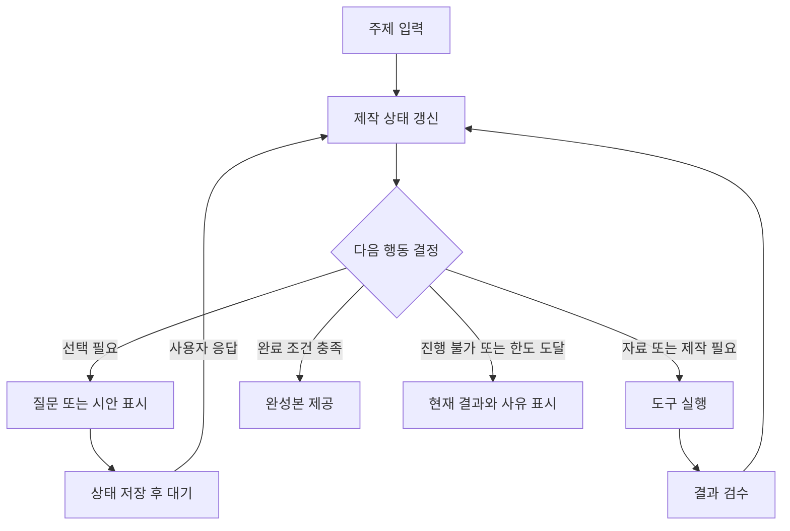

# 식물 카드뉴스 생성기: 사용자 참여형 에이전틱 워크플로

Human-in-the-loop Agentic Workflow — 제품·실행 구조 설계안

- 버전: 1.0
- 작성일: 2026-09-20
- 문서 목적: 사용자의 짧은 주제 입력을 출발점으로 의도 확인, 자료 조사, 기획, 이미지 제작, 검수와 수정을 수행하는 웹 서비스의 설계 기준을 정의한다.
- 범위: 서비스 기획 및 구현 명세 초안. 실제 서비스나 카드뉴스 이미지를 제작한 결과물은 아니다.
- 기술 전제: 특정 모델·프레임워크에 종속되지 않는다. 아래 API, 이벤트와 데이터 구조는 본 서비스용 제안이다.

## 1. 제품 개념

사용자는 “초보자가 키우기 좋은 식물로 카드뉴스 만들어줘”처럼 주제를 가볍게 전달한다. 에이전트는 요청을 해석하고, 필요한 경우 선택지를 제시하며, 도구를 활용해 완성된 카드뉴스를 만든다.

사용자는 상세한 프롬프트를 작성하는 대신 중요한 방향을 선택하고 결과를 보며 수정한다. 에이전트는 자료 조사와 반복 제작을 수행하고, 서버는 실행 상태와 비용·시간 한도를 관리한다.

### 핵심 용어

| 용어 | 본 서비스에서의 의미 |
| --- | --- |
| Agentic Loop | 현재 상태를 바탕으로 다음 행동을 결정하고, 도구 결과를 관찰하며 반복하는 실행 구조 |
| Human-in-the-loop | 실행 중 사용자의 선택·수정 입력을 받아 진행 방향을 바꾸는 방식 |
| Agentic Workflow | 고정된 제작 절차와 모델의 동적 판단을 결합한 전체 작업 흐름 |
| Agent Harness / Runtime | 모델 호출, 도구 실행, 상태 저장, 대기·재개, 오류 처리를 담당하는 실행 시스템 |
| 제작 명세 | 주제, 목적, 대상, 장별 구성, 디자인 규칙 등 현재 유효한 제작 조건 |

모델 내부 추론과 서비스 실행 루프는 별개다. 서비스는 모델의 비공개 내부 추론을 수집하는 대신, 행동·근거·제작 상태·검수 결과를 기록한다.

## 2. 설계 원칙

1. **짧은 입력으로 시작한다.** 최초 화면에서 상세 설문을 강제하지 않는다.
2. **중요한 불확실성만 질문한다.** 결과를 크게 바꾸는 목적·대상·스타일을 우선 확인한다.
3. **이미 알려준 내용은 다시 묻지 않는다.** 사용자 입력과 확정된 제작 명세를 먼저 확인한다.
4. **가정을 표시하고 수정 가능하게 한다.** AI의 추천을 사용자의 확정 조건으로 기록하지 않는다.
5. **작게 보여주고 구체적으로 조정한다.** 장별 기획과 표지 시안을 활용한다.
6. **자동 검수 후 결과를 제시한다.** 발견 가능한 오류를 사용자에게 그대로 넘기지 않는다.
7. **수정 범위를 제한한다.** 특정 카드 수정이 전체 재생성으로 이어지지 않게 한다.
8. **기다림은 상태로 관리한다.** 사용자 응답을 기다리는 동안 모델을 반복 호출하지 않는다.

## 3. 기본 사용 시나리오

### 3.1 최초 요청

> 초보자가 키우기 좋은 식물로 인스타 카드뉴스 만들어줘.

에이전트가 파악한 정보:

- 주제: 초보자용 식물 콘텐츠
- 채널: 인스타그램
- 대상: 식물 입문자로 추정
- 미확정: 정보 전달·구매 유도·브랜딩 중 제작 목적
- 제안 가능한 기본값: 5장, 4:5, 밝고 읽기 쉬운 디자인

5장·4:5는 이 서비스의 초기 제안값이며 플랫폼의 유일한 규격이라는 의미는 아니다. 사용자 지정과 채널 설정으로 변경할 수 있다.

### 3.2 목적 선택

화면 질문: **“이 카드뉴스로 어떤 반응을 얻고 싶으세요?”**

| 선택 | 화면 설명 | 기획에 반영할 내용 |
| --- | --- | --- |
| 정보 전달 | 유용해서 저장하고 다시 보기 | 관리 기준, 비교, 체크리스트 |
| 상품 관심 | 마음에 드는 식물을 더 알아보기 | 식물의 매력, 선택 기준, 상품 연결 |
| 브랜드 소개 | 브랜드의 분위기를 기억하기 | 사진, 감성 카피, 브랜드 이야기 |

별도 보조 기능으로 ‘직접 입력’과 ‘알아서 추천’을 제공한다. 선택지 수와 문구는 요청에 맞게 생성하되 화면 컴포넌트는 고정한다.

### 3.3 기획 제안

사용자가 ‘정보 전달’을 선택한 경우의 예시:

| 카드 | 역할 | 기획 초안 |
| --- | --- | --- |
| 1 | 관심 유도 | “첫 식물, 예쁜 것만 보고 고르셨나요?” |
| 2 | 선택 기준 | 집의 빛 환경부터 살펴보기 |
| 3 | 비교 | 검증된 식물 후보를 조건별로 비교하기 |
| 4 | 실수 예방 | 물주기 판단에 필요한 확인 항목 |
| 5 | 행동 유도 | 구매 전 체크리스트와 저장 안내 |

위 표는 구성 예시다. 특정 식물의 관리 조건과 안전성은 조사·검증 후 카피에 반영한다. 정보 전달 목적에서는 가격이나 구매 CTA를 자동으로 추가하지 않는다.

### 3.4 시안과 수정

표지 시안을 소수 제시하고 전체 제작 방향을 선택하게 한다. 사용자가 제작을 위임했다면 추천 시안으로 진행한다.

완성 후 “3장 설명을 더 짧게”, “사진을 더 크게”, “가격은 빼줘” 같은 자연어 수정과 카드별 직접 편집을 지원한다. 수정 지시의 대상이 불명확하고 영향이 크면 대상만 짧게 확인한다.

## 4. 전체 실행 흐름



기본 제작 단계는 ‘요청 해석 → 의도 확인 → 조사·기획 → 표지 시안 → 전체 제작 → 검수 → 내보내기’다. 상황에 따라 질문·조사를 생략하거나 필요한 단계로 돌아간다.

완료 조건은 필요한 카드가 모두 존재하고, 필수 검수를 통과하고, 다운로드 가능한 파일이 생성된 상태다. 사용자의 최종 확인이 필요한 모드에서는 확인까지 완료 조건에 포함한다.

## 5. 질문과 자동 진행 정책

### 질문 우선순위

| 상황 | 처리 |
| --- | --- |
| 제작 목적에 따라 내용이 크게 달라짐 | 목적 질문 |
| 대상이 모호하며 전문용어 수준에 영향 | 대상 질문 |
| 장수·비율이 없고 기본값으로 진행 가능 | 기본값을 표시하고 진행 |
| 디자인 취향이 불명확함 | 설명식 설문보다 시안 비교 활용 |
| 사용자가 이미 조건을 지정함 | 해당 항목은 재질문하지 않음 |
| 사용자가 ‘알아서’를 선택함 | 추천값을 가정으로 기록하고 진행 |
| 자료 간 사실관계가 충돌함 | 추가 조사 또는 해당 주장 제외; 선호 선택으로 해결하지 않음 |
| 상품 소개에 필요한 실제 상품 자료가 없음 | 상품 연결·업로드 요청 또는 일반 정보 콘텐츠 제안 |

질문 여부는 ‘결과에 미치는 영향’, ‘잘못 추정했을 때 재작업 비용’, ‘기본값 사용 가능성’, ‘사용자의 질문 부담’을 기준으로 결정한다. 모델이 출력한 신뢰도 숫자만으로 판단하지 않는다.

초기 UX 제안은 첫 기획 전에 질문 1~2개를 우선하는 것이다. 필수 정보가 더 필요하면 이유와 함께 추가로 묻는다. 자동 진행을 선택해도 유료 결제나 외부 게시 권한까지 부여된 것으로 해석하지 않는다.

## 6. 웹 UI 구성

| 영역 | 구성 요소 | 목적 |
| --- | --- | --- |
| 시작 화면 | 주제 입력, 선택적 이미지·상품 링크 첨부 | 입력 부담 최소화 |
| 제작 대화 | 진행 요약, 선택지, 자유 입력 | 의도 확인과 변경 요청 |
| 제작 명세 | 목적·대상·장수·스타일 요약 | 현재 조건 확인·편집 |
| 카드 작업 영역 | 썸네일 목록, 선택 카드 확대, 순서 변경 | 결과 중심 편집 |
| 비교 화면 | 표지·이미지 후보, 선택 버튼 | 시각적 선호 확인 |
| 완료 화면 | 개별 다운로드, 일괄 다운로드, 후속 수정 | 결과 활용 |

데스크톱에서는 제작 대화와 카드 작업 영역을 함께 배치할 수 있다. 모바일에서는 현재 필요한 질문이나 카드 편집에 집중하도록 전환한다.

### 사용자에게 보여줄 진행 메시지

- “입문자를 위한 정보형 콘텐츠로 구성하고 있어요.”
- “5장 구성을 준비했어요. 표지 분위기를 골라주세요.”
- “3장의 설명이 길어 문장을 줄이고 있어요.”
- “전체 카드의 글자 크기와 잘림을 확인하고 있어요.”

이 메시지는 실제 실행 상태에서 생성한다. 완료되지 않은 작업을 완료했다고 표시하거나 가상의 진행률을 만들지 않는다. 모델명, 도구 호출 인자, 비공개 추론 대신 사용자가 판단할 내용을 보여준다.

## 7. 서버와 에이전트의 역할

| 구성 요소 | 책임 |
| --- | --- |
| 웹 클라이언트 | 컴포넌트 렌더링, 응답 제출, 미리보기·편집 |
| 작업 API | 프로젝트 생성·조회, 사용자 입력 검증, 실행 요청 |
| 실행 조정기 | 다음 행동 선택 요청, 도구 호출, 상태 전이, 중단·재개 |
| 모델 | 의도 해석, 기획, 카피 작성, 필요한 행동 제안 |
| 도구 계층 | 검색, 상품 조회, 이미지 생성, 합성, 검수, 내보내기 |
| 상태 저장소 | 제작 명세, 대기 질문, 실행 기록, 버전 |
| 작업 큐·워커 | 긴 이미지 생성·렌더링 작업 처리 |
| 파일 저장소 | 원본 자료, 생성 이미지, 미리보기, 최종 파일 |

모델은 허용된 행동을 제안하고 서버가 스키마·작업 상태·권한·예산을 검사한 뒤 실행한다. 텍스트 배치 계산, 파일 생성 여부, 픽셀 규격 검사는 코드로 처리한다.

첫 구현은 단일 에이전트와 업무 도구로 시작한다. 역할이 여러 개라는 이유만으로 별도 에이전트를 만들 필요는 없다.

## 8. 작업 상태와 대기·재개

### 상태 모델

| 상태 | 의미 | 대표 다음 상태 |
| --- | --- | --- |
| `created` | 프로젝트 생성됨 | `running` |
| `running` | 판단·제작·검수 진행 중 | `waiting_user`, `waiting_tool`, `completed`, `failed`, `paused_budget`, `cancelled` |
| `waiting_user` | 사용자 응답 필요 | `running`, `cancelled` |
| `waiting_tool` | 비동기 도구 작업 진행 중 | `running`, `failed`, `paused_budget`, `cancelled` |
| `paused_budget` | 호출·비용·시간 한도로 중단 | 예산 변경 또는 범위 축소 후 `running`, 또는 `cancelled` |
| `completed` | 현재 버전 완성 | 새 수정 요청으로 후속 실행 생성 |
| `failed` | 자동 복구하지 못한 오류 | 사용자 재시도로 후속 실행 생성 |
| `cancelled` | 사용자가 중단함 | 명시적 재시작으로 후속 실행 생성 |

프로젝트와 개별 실행을 구분한다. 하나의 프로젝트에는 최초 제작 실행과 여러 수정 실행이 존재할 수 있다.

### 사용자 응답 대기

1. 서버가 질문 내용, 질문 ID, 프로젝트 버전, 재개 위치를 함께 저장한다.
2. `waiting_user` 이벤트를 웹 UI에 전달하고 실행을 종료 또는 일시 중단한다.
3. 사용자는 선택하거나 직접 입력한다. 이 동안 모델 호출은 발생하지 않는다.
4. 서버가 질문 ID, 응답 형식, 현재 버전, 중복 응답 여부를 검증한다.
5. 응답 적용과 재개 예약을 트랜잭션·아웃박스 등으로 일관되게 처리한다.
6. 저장된 상태에서 후속 실행을 이어간다.

모델의 tool call을 이용해 질문을 요청했다면, 재개할 때 해당 호출 ID와 사용자 응답을 제공업체의 tool result 규약에 맞게 연결한다. API가 요구하는 대화·추론 상태 항목은 공식 규약대로 보존한다.

새로고침·재접속 시 프로젝트 조회 API에서 현재 질문과 결과를 복원한다. 브라우저 연결이 끊겨도 서버 작업 상태를 잃지 않는다.

## 9. 제작 데이터 구조

대화 원문과 현재 제작 명세를 분리한다. 아래는 개념 스키마다.

```json
{
  "project_id": "project_example",
  "revision": 7,
  "status": "waiting_user",
  "brief": {
    "topic": "초보자를 위한 식물 선택",
    "purpose": {"value": "educate", "origin": "user_confirmed"},
    "audience": {"value": "식물 입문자", "origin": "ai_assumed"},
    "channel": {"value": "instagram", "origin": "user_explicit"},
    "card_count": {"value": 5, "origin": "default"},
    "canvas": {"width": 1080, "height": 1350},
    "constraints": ["가격 표시 없음", "구매 유도 없음"]
  },
  "design": {
    "style_id": null,
    "font_family": null,
    "palette": [],
    "template_version": null
  },
  "cards": [],
  "sources": [],
  "pending_request_id": "style_01",
  "budget": {
    "max_model_calls": 20,
    "max_repair_rounds_per_card": 2,
    "max_image_jobs": 8,
    "max_active_seconds": 600
  }
}
```

예산 수치는 벤치마크로 조정할 초기 예시이며 품질·속도 보장값이 아니다. 사용자 응답 대기 시간은 활성 실행 시간과 분리한다. 신규 수정 실행에는 별도 한도를 적용하되 프로젝트 누적 비용도 기록한다.

카드별로 안정적인 `card_id`, 표시 순서, 역할, 제목·본문·CTA, 이미지 참조, 레이아웃, 버전, 검수 상태를 저장한다. 카드를 재정렬해도 식별자는 유지한다.

출처에는 URL 또는 내부 자료 ID, 조회 시각, 지원하는 주장, 사용한 이미지의 출처·사용 조건을 기록한다. 상품 조회 결과와 검증된 관리 정보를 같은 수준의 사실 근거로 취급하지 않는다.

## 10. 모델과 UI 사이의 메시지 규약

임의의 HTML을 모델이 반환하게 하기보다, 허용된 컴포넌트와 JSON 스키마를 사용한다. 서버가 검증한 데이터만 UI에 전달한다.

### 선택지 요청 예시

```json
{
  "type": "request_user_input",
  "request_id": "purpose_01",
  "project_revision": 2,
  "component": "single_select",
  "field": "brief.purpose",
  "question": "이 카드뉴스로 어떤 반응을 얻고 싶으세요?",
  "options": [
    {"value": "educate", "label": "유용해서 저장하기"},
    {"value": "conversion", "label": "상품에 관심 갖기"},
    {"value": "branding", "label": "브랜드 기억하기"}
  ],
  "allow_free_text": true,
  "allow_delegate": true
}
```

### 사용자 응답 예시

```json
{
  "request_id": "purpose_01",
  "project_revision": 2,
  "response_id": "response_example_01",
  "answer": {"selected_value": "educate"}
}
```

`response_id`는 중복 제출을 식별한다. 자유 입력·위임·선택은 스키마에서 구분하고, 유효한 값만 받는다. 오래된 질문에 대한 응답은 새 상태를 덮어쓰지 않게 처리한다.

### 서버 이벤트

| 이벤트 | 내용 |
| --- | --- |
| `progress.updated` | 실제 작업 단계와 짧은 설명 |
| `brief.updated` | 제작 조건 변경 |
| `input.requested` | 사용자 선택·입력 요청 |
| `preview.ready` | 카드 또는 시안 미리보기 준비 |
| `card.updated` | 특정 카드의 새 버전 |
| `validation.updated` | 검수 상태 변경 |
| `run.paused` | 한도 도달 등으로 실행 중단 |
| `run.failed` | 복구하지 못한 오류 |
| `run.completed` | 완성 파일과 결과 요약 |

공통 필드로 `event_id`, `project_id`, `run_id`, `revision`, `occurred_at`을 둔다. 이벤트 전달에는 SSE 등을 사용하고, 사용자 응답은 HTTP 요청으로 받을 수 있다. 재연결 시 누락 이벤트를 재생하거나 최신 상태를 다시 조회한다. 전송 방식과 관계없이 서버 상태를 기준으로 한다.

## 11. 도구 구성

아래 이름은 본 서비스에서 정의할 도구의 예시다.

| 도구 | 역할 | 반환 시 필요한 정보 |
| --- | --- | --- |
| `search_plant_sources` | 식물 정보 근거 검색 | 출처, 요약, 조회 시각 |
| `get_product_candidates` | 상품 API 조회 | 상품 ID, 이미지, 조회 시점의 가격·재고 |
| `get_brand_assets` | 승인된 브랜드 자료 조회 | 로고, 색상, 글꼴, 사용 규칙 |
| `generate_visual` | 배경·일러스트·연출 이미지 생성 | 작업 ID, 상태, 파일 참조 |
| `render_card` | 카피와 이미지를 레이아웃으로 합성 | 카드 ID, 파일 참조, 실제 규격 |
| `validate_card` | 규격·텍스트·시각 검수 | 통과 여부, 문제 위치, 심각도 |
| `export_cards` | 개별 이미지와 일괄 파일 생성 | 파일 목록, 크기, 형식 |

모든 도구는 성공·자료 없음·재시도 가능한 실패·영구 실패를 구분한다. 생성 작업에는 요청 식별자를 저장하고, 타임아웃 시 기존 작업 상태를 조회한 뒤 재시도한다. 제공업체가 멱등 키를 지원하지 않는 경우에는 외부 요청의 정확히 한 번 실행을 보장한다고 가정하지 않는다.

독립적인 자료 조회와 카드 렌더링은 제한된 동시성으로 병렬 처리할 수 있다. 전체 기획·디자인 규칙이 확정되기 전에는 무조건 모든 이미지를 동시에 생성하지 않는다.

## 12. 카드뉴스 제작·검수 기준

### 제작 방식

사진·일러스트와 텍스트·레이아웃을 분리한다. 이미지 생성 도구는 시각 자산을 만들고, 별도의 렌더러는 편집 가능한 카피를 배치한다. 수정 시 영향을 받는 계층만 갱신한다.

전체 카드에 동일한 디자인 규칙을 적용하되 장별 역할에 따라 레이아웃을 달리한다. 제목·본문 크기, 안전 여백, 색상, 사진 처리, 페이지 표시 규칙을 디자인 토큰으로 관리한다.

### 검수 항목

| 영역 | 확인 내용 | 검수 방법 |
| --- | --- | --- |
| 요구사항 | 목적·장수·제외 조건 준수 | 제작 명세와 결과 비교 |
| 식물 정보 | 종 식별, 관리 조건, 단정적 표현 | 출처 대조와 내용 검토 |
| 안전 관련 주장 | 반려동물 관련 표현 등 근거 필요 여부 | 적합한 출처 확인; 불확실하면 단정 제외 |
| 상품 정보 | 이미지·상품 ID 일치, 가격·재고 시점 | 내부 상품 API 대조 |
| 문구 | 오탈자, 중복, 장별 연결, CTA 적합성 | 텍스트 검사와 모델 검토 |
| 레이아웃 | 글자 잘림, 겹침, 영역 이탈 | 렌더러의 배치 검사 |
| 가독성 | 모바일 크기에서 읽힘, 대비 | 축소 미리보기와 시각 검토 |
| 일관성 | 색상·글꼴·사진 분위기 유지 | 디자인 규칙 비교 |
| 출력 | 실제 파일 존재, 규격·형식·장수 | 파일 메타데이터와 디코딩 검사 |

AI 이미지의 외형만으로 실제 식물 품종을 확정하지 않는다. 특정 상품 소개는 가능한 한 해당 상품 원본 이미지를 사용하고, 생성 이미지가 상품 사진을 대체하는 경우 표현의 정확성을 별도로 검토한다.

검수는 오류 가능성을 줄이는 장치이며 모든 사실 오류를 완전히 제거한다고 보장하지 않는다. 자동 검수로 해결하지 못한 중요 문제는 완료로 처리하지 않고, 제외·수정·추가 자료 요청 중 하나로 전환한다.

## 13. 수정과 버전 관리

| 사용자 요청 | 영향 범위 | 처리 |
| --- | --- | --- |
| “3장 설명만 짧게” | 해당 카드 카피·배치 | 카피 변경 후 해당 카드 검수·렌더링 |
| “모든 제목을 크게” | 전체 제목 스타일·배치 | 공유 토큰 수정, 영향 카드 재검수 |
| “2장 사진만 교체” | 해당 시각 자산·배치 | 이미지 교체 후 국소 검수 |
| “구매 유도를 빼줘” | 전체 문구·CTA·기획 | 목적·제약 갱신 후 관련 카드 재검토 |
| “대상을 전문가로” | 기획·용어·자료 | 전체 내용 의존성 재검토 |
| “5장을 7장으로” | 구성·순서·연결 문구 | 재구성 후 기존 자산 재사용 |

명세·카피·자산·렌더링의 의존 관계를 기록하고 영향을 받은 결과를 `stale`로 표시한다. 이전 버전은 보존하며 새 파일로 저장한다.

이미지 생성 중 사용자가 명세를 변경하면 이전 버전의 작업 결과가 최신 화면을 덮어쓰지 않게 한다. 늦게 도착한 결과는 원래 버전에 연결하고, 재사용 가능성은 별도 판단한다.

## 14. 오류 복구와 운영 관찰

- 사용자 입력이 없으면 `waiting_user`로 유지하며 반복 질문을 발송하지 않는다.
- 도구 오류는 일시 실패와 잘못된 입력을 구분한다. 일시 실패는 제한적으로 재시도하고, 입력 오류는 수정 후 실행한다.
- 동일 호출이 반복되고 새 근거·산출물이 없다면 재계획하거나 실행을 중단한다.
- 이미지 생성·렌더링 한도에 도달하면 현재까지의 결과와 남은 작업을 표시한다.
- 취소된 실행의 늦은 응답은 최신 상태에 자동 반영하지 않는다.
- 프로젝트 접근 권한은 모델이 아니라 서버에서 검사한다. 외부 자료의 지시문은 제작 명령으로 취급하지 않는다.

실행 기록에는 모델·프롬프트·도구 버전, 호출 인자와 결과 참조, 비용·시간, 상태 전이, 사용자 선택, 검수 결과를 남긴다. 이미지 원본이나 긴 검색 결과를 매 턴 모두 다시 입력하지 않고 필요한 자료만 전달한다.

## 15. MVP 범위와 검증 시나리오

### 최초 구현 범위

- 주제 입력과 선택적 참고 이미지 첨부
- 목적·스타일 확인과 자동 추천
- 장별 기획, 표지 시안, 전체 카드 생성
- 프로젝트 저장, 대기·재개, 새로고침 복원
- 카드별 문구·이미지 수정과 버전 관리
- 기본 내용·레이아웃 검수
- 개별 이미지와 일괄 파일 다운로드

상품 API·브랜드 프로필 연동은 후속 단계로 확장할 수 있다. 자동 SNS 게시, 예약 발행, 별도 멀티에이전트 구조는 최초 범위에 포함하지 않는다.

### 수용 기준

| 시나리오 | 기대 결과 |
| --- | --- |
| 주제 한 줄만 입력 | 중요한 질문 또는 추천 명세로 진행 |
| 상세 조건을 모두 입력 | 이미 제공한 조건을 다시 묻지 않음 |
| ‘알아서 추천’ 선택 | 가정을 기록하고 제작을 이어감 |
| 선택 대기 중 새로고침 | 같은 질문·시안을 복원 |
| 같은 선택을 두 번 제출 | 한 번만 상태에 반영 |
| 오래된 질문에 응답 | 최신 명세를 덮어쓰지 않음 |
| 이미지 요청 직후 타임아웃 | 기존 작업 확인 후 복구; 무조건 중복 생성하지 않음 |
| 3장만 수정 | 관련 없는 카드 결과를 보존 |
| 생성 도중 목적 변경 | 이전 결과가 최신 버전을 덮어쓰지 않음 |
| 검수 반복 실패 | 한도 내에서 중단하고 해결하지 못한 내용을 표시 |
| 파일 생성 실패 | 완료 상태와 정상 다운로드를 허위 표시하지 않음 |

실제 요청으로 평가셋을 구성하고 작업 성공률, 첫 시안 채택률, 질문 수, 사용자 수정 횟수, 평균·p95 제작 시간, 성공 작업당 비용, 중복 생성률, 복구 성공률을 측정한다. 시간은 사용자 대기 포함·제외를 나눠 기록한다. 목표값은 초기 운영 데이터를 확인한 뒤 설정한다.

## 16. 구현 전에 확정할 항목

| 항목 | 초기 방향 | 결정할 내용 |
| --- | --- | --- |
| 콘텐츠 목적 | 정보 전달·상품 관심·브랜딩 | 초기 제공 범위 |
| 기본 출력 | 5장, 1080×1350 제안 | 채널별 프리셋 |
| 제작 모드 | 필요한 선택만 받는 기본 모드 | 자동 위임·단계별 확인 범위 |
| 이미지 공급 | 업로드·원본 자료·생성 이미지 | 출처·사용 조건 정책 |
| 브랜드 규칙 | 프로젝트별 설정 | 계정별 브랜드 프로필 지원 |
| 렌더링 | 자산과 텍스트 분리 | 사용할 렌더러·템플릿 체계 |
| 실행 예산 | 작업별 제한 | 요금제·모델별 실제 한도 |
| 데이터 연결 | 선택적 상품 API | 읽기 범위와 제공 필드 |

## 17. 참고 자료

아래 자료는 용어와 실행 패턴의 근거다. 본 문서의 제품 흐름, JSON, API·도구 명칭, 기본값은 서비스 설계 제안이다.

1. [Anthropic — Building effective agents](https://www.anthropic.com/engineering/building-effective-agents): 고정 워크플로와 동적 에이전트의 구분, 단순한 구조에서 출발하는 접근.
2. [ReAct: Synergizing Reasoning and Acting in Language Models](https://arxiv.org/abs/2210.03629): 추론·행동·관찰을 결합한 대표 패턴.
3. [LangGraph — Interrupts](https://docs.langchain.com/oss/javascript/langgraph/interrupts): 사용자 입력을 위한 실행 중단, 상태 저장과 재개. 특정 프레임워크의 구현 예시이며 필수 의존성이 아니다.
4. [Anthropic — Effective context engineering for AI agents](https://www.anthropic.com/engineering/effective-context-engineering-for-ai-agents): 필요한 컨텍스트 선택과 장기 작업 상태 관리.
5. [Anthropic — Writing effective tools for agents](https://www.anthropic.com/engineering/writing-tools-for-agents): 도구 설명·인자·결과 설계와 평가.
6. [Anthropic — Demystifying evals for AI agents](https://www.anthropic.com/engineering/demystifying-evals-for-ai-agents): 최종 결과와 실행 기록을 함께 평가하는 접근.
