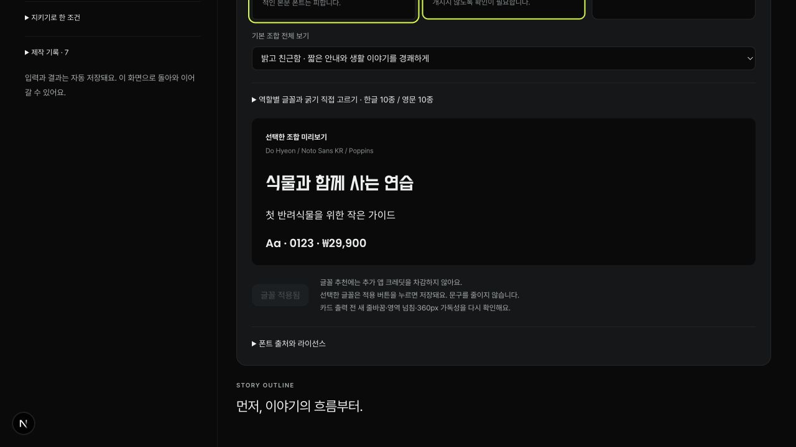
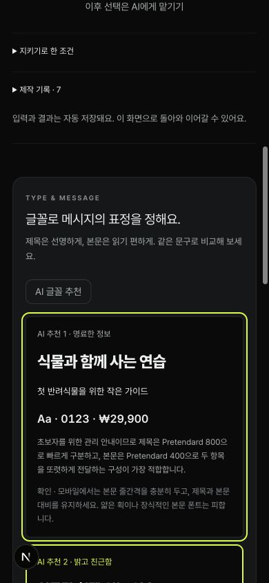
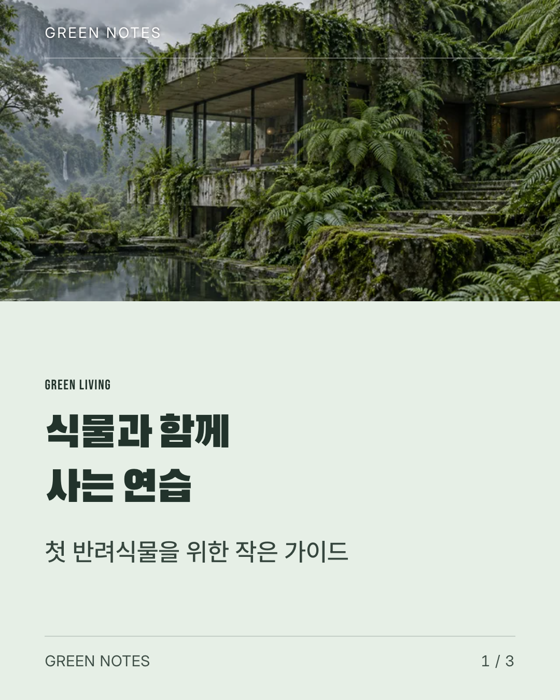
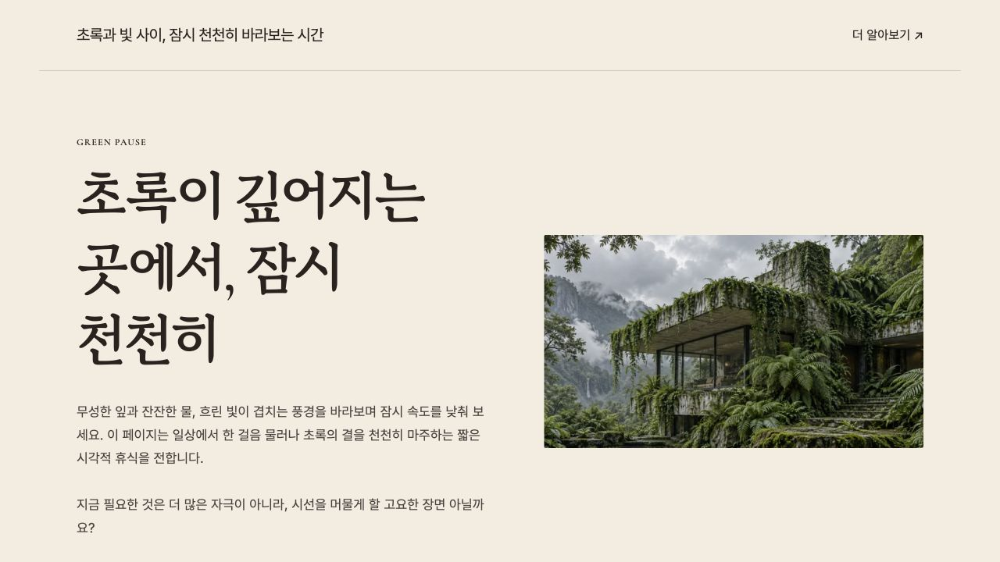

# 타이포그래피 워크플로우 검증

검증일: 2026-09-21 · 로컬 개발 서버 `http://127.0.0.1:3000`

## 반영 내용

- [첨부 원본 가이드](../../free-webfont-guide.md)를 수정 없이 저장했다. 원본 파일과 `cmp` 비교가 일치한다.
- [구현 설계](../../typography-workflow-plan.md)에 따라 한글 10종·영문 10종, 목적별 6개 조합, 제목/본문/영문 강조 역할과 실제 굵기를 등록했다.
- 카드뉴스·랜딩·제품 상세의 AI 기획 단계에서 서로 다른 3개 조합을 이유·주의점과 함께 제안한다. 같은 원고를 비교하고 적용하거나 역할별로 직접 바꿀 수 있다. 초안과 일반 편집기에서도 변경한다.
- 폰트만 변경할 때 원고·이미지·순서를 유지한다. 확정된 글꼴을 새 AI 추천이 덮어쓰지 않는다. 카드 PNG와 출력 검수는 무효화해 다시 확인하도록 한다.
- 실제 지원 글리프를 검사하고 한글 누락은 본문·기본 폰트로 보완한다. 전체 체인에 없는 문자는 출력 전 안내한다. 파일 해시·로딩 실패 시 대체 폰트로 조용히 출력하지 않는다.
- 한글 제목과 영문 강조에 별도의 굵기별 CSS 패밀리를 사용한다. 혼합 제목에서도 서로의 굵기를 덮어쓰지 않는다. 단일 굵기 폰트는 굵기 선택을 잠그며 합성 bold/italic은 사용하지 않는다.

## 실제 API 및 UI 검증

| 검증 | 결과 |
| --- | --- |
| OpenAI 실제 모델 | 저장된 `gpt-5.6-terra`, effort `low` |
| 식물 관리 카드 기획 | 정보 전달 목적에 `clear` 우선, `friendly`, `natural` 대안 제안 |
| 사용자 선택 | 기획 UI에서 `friendly` 적용, 서버 `confirmed: true` 저장 |
| 원고 보호 | 변경 전후 모든 슬롯의 깊은 비교 일치, 입력 중인 기획 의견도 보존 |
| 랜딩 추천 | 초록·빛·휴식 원고의 긴 제목과 분위기를 반영한 `natural`, `premium`, `clear` 추천 |
| 카드 편집기 | Black Han Sans / Pretendard / Bebas Neue 선택·저장·다시 열기 확인, 단일 굵기 400 선택 잠금 |
| 제품 상세 편집기 | Noto Serif KR / Pretendard / Playfair Display 적용, 상품명·문구 보존, 모바일 제목 32px |
| 모바일 선택 UI | 390px, 추천 조합 한 열, 문서 가로 너비와 스크롤 너비 모두 390px |
| 독립 HTML 모바일 | 390px, 가로 넘침 없음, 제목 36px·본문 17px |

[실제 기획 응답과 저장 증거](live-plan-evidence.json). 이 QA 실행만 종료하여 예약 1크레딧을 환불했고 잔액은 285로 복구했다. 실제 외부 모델 호출 비용은 공급자 사용량에 포함된다. 새 이미지·영상 생성은 수행하지 않았다.

## 출력 검증

브라우저의 실제 ‘내보내기’로 생성한 파일을 서버의 완료 링크에서 다시 받았다. [출력 ID·선택값·해시 검증](export-evidence.json).

- [카드 PNG ZIP](card-statement.zip): 1080×1350 PNG 3장, caption.txt, project.json. 확정 문구와 줄바꿈, 제목 강조, 리스트 숫자와 경계를 직접 확인했다. 글꼴 변경 전후 카드 데이터가 일치한다.
- [랜딩 HTML ZIP](landing-website.zip): 선택 폰트·보완 폰트 5개와 각각의 OFL·manifest·이미지 포함. 모든 폰트의 SHA256이 일치한다. 앱과 분리한 임시 로컬 서버에서 ZIP 파일만으로 표시했다.
- [제품 상세 HTML ZIP](product-website.zip): 선택 폰트·보완 폰트 4개와 OFL·manifest 포함, 모든 해시 일치, 상품명·슬롯 원고 불변. 이 샘플은 서체 검증용이며 신규 상품 사진은 생성하지 않았다.
- 독립 랜딩의 실제 렌더링 폰트를 브라우저 CSS 진단으로 확인했다. 한글 제목은 `GowunBatang-Bold`, 영문·문장부호는 `CormorantGaramond-SemiBold`로 각각 700/600 선택값이 유지됐다.

## 자동 검증

- [전체 138개 테스트 통과](tests-all.txt).
- 굵기별 CSS 패밀리 보완 후 [워크플로우 관련 41개 통과](tests-workflows.txt), 추가 회귀 검증 [7개 통과](tests-catalog.txt).
- [프로덕션 빌드 및 TypeScript 검사 통과](build.txt), `git diff --check` 통과.
- 검증 범위: 허용 폰트·역할·굵기, 고정 파일 해시와 라이선스, 실제 cmap, 추천 형식·실패 응답·소유권·버전 충돌·추가 앱 크레딧 미차감, 세 포맷 저장/복원, 확정 선택 보호, 카드 출력 검수 무효화, 페이지 인계 시 선택 유지.

이번 검증은 로컬 구현과 출력에 대한 검증이다. 모든 폰트와 모든 가능한 사용자 원고 조합의 픽셀 품질을 보장하지 않으며, 실제 긴 원고는 선택 후 모바일 미리보기와 출력 검수를 계속 사용한다. 기존 프로젝트는 사용자가 적용하기 전 기존 서체를 유지한다.
