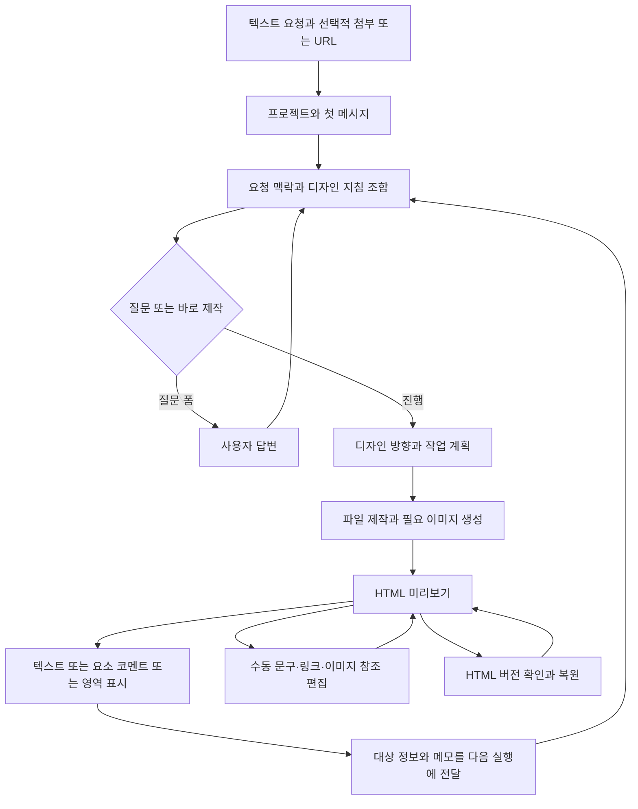

# Open Design 디자인 사용자 참여형 에이전틱 워크플로우 참고서

작성일: 2026-09-28

이 문서는 Open Design에서 분석한 디자인 제작·사용자 참여·수정 흐름을 추후 독립적으로 참고하기 위한 보존 문서다. 기존 1차 코드 분석을 재구성했으며, Openhiggsfield의 도입 결정과 사용자 인터뷰 요구사항을 Open Design의 기능으로 섞지 않는다.

## 1. 분석 기준과 읽는 방법

| 항목 | 기준 |
| --- | --- |
| 원본 저장소 | nexu-io/open-design |
| 분석한 로컬 저장소 | `/Users/brian/works/github/open-design` |
| 로컬 origin | merong/open-design — 1차 조사에서 nexu-io 원본의 포크 관계 확인 |
| 기준 커밋 | `56d51b8c99849eccc0bb247dc99ef43a83938da1` |
| 집중 범위 | 디자인 요청, 의도 확인, 디자인 방향·페이지·이미지 계획, 미리보기, 영역 코멘트, 수정, 버전 복원 |
| 부수 범위 | 실행 어댑터·저장·스트리밍·검수의 연결 구조 |
| 검증 수준 | 코드와 테스트 소스의 정적 분석. 앱·테스트·모델 호출 및 출력 품질 검증은 수행하지 않음 |

[분석 커밋](https://github.com/nexu-io/open-design/commit/56d51b8c99849eccc0bb247dc99ef43a83938da1)은 최신 버전의 동작을 뜻하지 않는다. 아래의 **확인**은 해당 커밋의 코드 연결 확인이며, **미확인**은 조사한 경로에서 근거가 부족하다는 뜻이다. Claude Design과 기능·품질이 동등한지도 검증하지 않았다.

## 2. 전체 참여 흐름

이 도식의 분기는 대부분 모델이 읽는 프롬프트 규칙이다. 독립적인 서버 판단기가 모든 질문·승인·수정 범위를 강제하는 상태 머신으로 해석하면 안 된다. 일반 제작 앞에 계획 승인이나 대표 시안 승인이 항상 강제되는 계약은 확인하지 못했다. 근거: [R02~R05](reference-catalog.md#r02), [R08~R13](reference-catalog.md#r08).

## 3. 시작 입력과 의도 확인

텍스트와 사진은 공통 Home/chat 입력으로 받는다. 첨부는 프로젝트 생성 후 업로드하고 상대경로·순서를 모델 맥락에 포함한다. URL도 텍스트로 전달할 수 있다. 이는 세 가지 전용 입력 모드가 구현돼 있다는 뜻이 아니라 공통 채팅이 수용하는 입력 방식이다. 선택한 플러그인의 필수 입력 제약은 별도로 존재한다.

URL 기반 브랜드 수집에는 HTML/CSS·색상·폰트·로고·문구를 모으는 구현이 있다. 그러나 일반 채팅의 모든 상품 URL이 그 수집기로 자동 연결되거나 상품 사양까지 정확하게 추출된다는 증거는 아니다. 도구를 사용할 수 없는 API 경로에서는 URL을 읽을 수 없어 자료를 질문하도록 안내한다. 근거: [R01](reference-catalog.md#r01), [R07](reference-catalog.md#r07).

### 질문과 바로 제작의 분기

| 상황 | 확인된 정책·구현 |
| --- | --- |
| 새 디자인 요청 | 기본적으로 첫 턴에 질문 폼을 출력하고 종료하도록 지시. 입력이 풍부해도 질문하는 기본 정책 |
| 이미 제공한 정보 | 프로젝트 metadata·plugin inputs에 있는 답을 재질문하지 않도록 지시 |
| 기존 디자인의 명확한 수정 또는 명시적 바로 제작 | 질문 폼을 생략하는 예외 |
| `skipDiscoveryBrief` | 계획·제작으로 바로 진행하고 안전하게 추론할 수 없는 필수 사항만 질문하도록 override |
| 충분한 memory와 rewrite 조건 | 의도 요약 `task-brief` 카드로 질문을 대체하고 확인을 기다리지 않도록 지시 |
| 참고 자료를 선택했지만 실제 자료가 없음 | 자료를 요청하며 브랜드 정보를 임의로 만들지 않도록 지시 |

`<question-form>`은 모델이 출력한 텍스트를 웹에서 UI로 파싱한 것이다. 답변은 `[form answers — id]` 형태의 다음 사용자 메시지로 돌아오고 daemon이 해당 답변용 지시를 붙여 새 실행을 시작한다. 중단된 네이티브 도구 호출에 반환값을 넣는 방식과 다르다. 질문의 필요성과 실제 준수 여부는 프롬프트 테스트만으로 입증되지 않는다. 근거: [R03](reference-catalog.md#r03), [R04](reference-catalog.md#r04).

## 4. 디자인 방향을 제작으로 연결하는 방식

| 구성 요소 | 분석에서 확인한 역할 | 해석상의 경계 |
| --- | --- | --- |
| 디자인 시스템 `DESIGN.md` | 색상·타이포 등 디자인 토큰과 방향 제공 | 상품 사실이나 이미지 정확성을 검증하는 장치는 아님 |
| craft | 선택한 디자인을 구현할 때 따를 제작 규칙 제공 | 규칙을 모델이 항상 준수한다는 보장은 아님 |
| skill | 작업 절차와 참고 파일·템플릿 사용법 제공 | 모든 스킬이 모든 요청에 자동 적용되는 것은 아님 |
| template | 기존 화면·파일을 기반으로 구체적인 결과 제작 | 특정 템플릿의 정책을 전체 제품의 공통 정책으로 볼 수 없음 |
| TodoWrite 계획 | 섹션·파일 작업·검수 등의 진행 계획 표시 | 이미지 생성 인자를 검증하는 구조화 계약과 다름 |
| design-brief | 자연어 취향을 디자인 차원·기본 토큰으로 해석하도록 안내 | 범용 상품 사실 추출기가 아님 |

기존 디자인 시스템을 선택했으면 해당 방향을 존중하고 관련 질문을 줄이도록 지시한다. 참고 사이트·브랜드 가이드가 있으면 출처에서 방향을 추출하고, 별도 출처가 없으면 AI가 방향을 선택하도록 하는 분기도 있다. 일반 `sessionMode=plan`은 Markdown 계획 문서 작업 모드이며 제작 전 승인 트랜잭션과 동일하지 않다. 근거: [R03](reference-catalog.md#r03), [R05](reference-catalog.md#r05), [R15](reference-catalog.md#r15).

## 5. 페이지 구성과 이미지 계획

일반 흐름은 프롬프트·계획·디자인 시스템을 바탕으로 에이전트가 파일을 작성한다. 공통 `ChatRequest`에서 페이지 전용 `pagePlan`, `imageSlots`, 확정 상품 사실 집합을 강제하는 계약은 확인하지 못했다.

구체적인 연결 사례는 `design-templates/open-design-landing`이다.

1. 입력 문구·브랜드 정보와 고정 이미지 manifest를 읽는다.
2. 16개 슬롯의 역할별 프롬프트와 브랜드·스타일 지시를 조합한다.
3. 슬롯의 `width/height`를 생성 API의 `image_size`로 전달한다.
4. 정해진 슬롯 파일명을 HTML에서 참조한다.
5. `--only`로 일부 생성, `--force`로 기존 파일 재생성을 선택할 수 있다.

이 사례는 **계획한 크기·파일이 실제 생성·배치로 연결되는 방식**을 보여준다. 다만 이미지 수량이 고정되어 있고 템플릿은 여러 질문 그룹을 요구한다. 사용자 의도에 따라 이미지 수량을 최적화하는 범용 기능으로 해석할 수 없다. 생성 해상도·생성 비율·페이지 표시 크기·크롭도 별개의 값이다. 근거: [R06](reference-catalog.md#r06), [R12](reference-catalog.md#r12).

## 6. 미리보기에서 사용자가 수정에 참여하는 방식

| 기능 | 사용자 입력과 데이터 | 처리 경로 |
| --- | --- | --- |
| 요소 코멘트 | 선택자·요소 ID·위치·현재 문구·스타일·메모·참고 이미지 | 저장 코멘트를 채팅 작업으로 전달 |
| Mark/Draw | 클릭 박스·펜 표시·메모·영역 경계와 이를 합성한 스크린샷 | annotation 이벤트 → composer → 채팅 실행 |
| 텍스트 수정 요청 | 자연어 요청과 현재 프로젝트·대화 맥락 | 공통 채팅 실행 |
| 수동 Edit | 문구, 링크, 이미지 src/alt 및 HTML/style 변경 | 수동 편집 경로에서 HTML 저장 |

요소 코멘트는 `PreviewCommentTarget`으로 대상을 표현한다. 서버의 `normalizeCommentAttachments`가 대상을 정규화하고 `renderCommentAttachmentHint`가 모델에게 대상과 메모를 전달한다. 범위 밖 변경이 필요하면 먼저 질문하도록 지시하지만, 이 경로에서 파일 변경을 선택 영역 안으로 강제하는 검증은 확인하지 못했다.

저장 코멘트 여러 개를 보내는 경로는 코멘트별 queue task로 처리한다. 작업 중에는 Send/Queue/Draft 분기가 있으며, 모든 코멘트를 하나의 통합 수정 계획으로 병합한다고 볼 수 없다. 연결된 저장 코멘트는 실행 성공 후 `needs_review`, 실패 시 `failed`가 된다. 실행 성공과 사용자의 적절성 확인을 구분한다. 자유 Mark가 항상 같은 저장 코멘트 수명주기를 갖는 것은 아니다. 근거: [R08](reference-catalog.md#r08), [R09](reference-catalog.md#r09), [R10](reference-catalog.md#r10), [R11](reference-catalog.md#r11).

### 영역 표시와 이미지 부분 수정의 차이

HTML 위에 표시한 좌표·스크린샷은 수정 의도를 전달하는 자료다. 원본 이미지 좌표에 맞는 인페인팅 마스크로 연결된다고 확인하지 못했다. 독립 이미지 뷰어에도 동일한 Mark UI가 연결되어 있지 않다.

공통 미디어 요청에는 `model/prompt/aspect/image/images/output` 등이 있지만 mask 인자는 없다. 분석 커밋의 OpenAI 직접 이미지 renderer는 요청 본문에 `imageRef`를 보내지 않고, fal renderer에는 참조 이미지 전달 코드가 있다. 모델 카탈로그의 inpaint 표시는 UI → 마스크 → provider 연결이 완성됐다는 증거가 아니다. 근거: [R09](reference-catalog.md#r09), [R12](reference-catalog.md#r12).

## 7. 수정 후 검수·버전·복구

HTML 변경을 기록하고 이전 버전을 미리 보거나 복원할 수 있다. 복원은 이전 HTML을 쓰고 새 복원 버전을 남긴다. 그러나 같은 경로의 이미지 파일이 덮어써졌다면 HTML만 복원해도 이전 이미지가 돌아온다고 보장할 수 없다. 이미지 후보 비교·채택과 페이지 에셋 전체 복구는 별도 기능으로 봐야 한다. 근거: [R13](reference-catalog.md#r13).

일반 제작에는 체크리스트와 자기평가 지시가 있다. 선택적 Design Jury는 기본 비활성이며 실행 조건도 제한된다. 평가 점수나 완료 상태가 최종 페이지의 반응형 품질·상품 정확성·이미지 적절성을 객관적으로 입증하지는 않는다. 근거: [R14](reference-catalog.md#r14).

SSE 구독 종료와 사용자 취소는 분리되어 있다. 취소가 이미 변경한 파일까지 원복한다는 뜻은 아니다. 실행 중 메모리 상태와 대화·세션 저장도 별도이므로 로그가 있다는 이유만으로 프로세스 재시작 후 자동 복구를 보장할 수 없다. 근거: [R15](reference-catalog.md#r15).

## 8. 다시 참고할 핵심 코드

아래 상대경로는 위 분석 저장소 기준이다. [코드 카탈로그](reference-catalog.md)에서 라인·심볼·SHA 고정 링크를 찾을 수 있다.

| 관심사 | 핵심 경로 | 근거 |
| --- | --- | --- |
| 최초 질문·질문 생략·디자인 방향 | `apps/daemon/src/prompts/discovery.ts`, `apps/daemon/src/prompts/system.ts` | [R03](reference-catalog.md#r03) |
| 질문 UI와 답변 재진입 | `apps/web/src/artifacts/question-form.ts`, `apps/web/src/components/QuestionForm.tsx` | [R04](reference-catalog.md#r04) |
| 디자인 계획·자연어 디자인 해석 | `apps/daemon/src/prompts/discovery.ts`, `skills/design-brief/SKILL.md` | [R05](reference-catalog.md#r05) |
| 이미지 슬롯과 실제 생성값 | `design-templates/open-design-landing/assets/image-manifest.json`, `design-templates/open-design-landing/scripts/imagegen.ts` | [R06](reference-catalog.md#r06) |
| 코멘트 대상 계약 | `packages/contracts/src/api/comments.ts` | [R08](reference-catalog.md#r08) |
| 영역 표시 UI | `apps/web/src/components/PreviewDrawOverlay.tsx` | [R09](reference-catalog.md#r09) |
| 코멘트의 프롬프트 변환 | `apps/daemon/src/runtimes/chat-prompt-inputs.ts` | [R10](reference-catalog.md#r10) |
| 이미지 생성 파라미터 | `apps/daemon/src/media/index.ts` | [R12](reference-catalog.md#r12) |
| HTML 버전 스냅샷 | `apps/daemon/src/run-html-version-snapshots.ts` | [R13](reference-catalog.md#r13) |
| 맥락 조합과 실행 | `apps/daemon/src/prompts/system.ts`, `apps/daemon/src/runtimes/runs.ts` | [R15](reference-catalog.md#r15) |

## 9. 참고 가치와 아직 입증되지 않은 연결

재검토할 가치가 있는 패턴은 공통 요청 경로로 돌아오는 사용자 피드백, 대상 정보를 포함한 코멘트 계약, 모델 출력에서 생성되는 질문 UI, 디자인 시스템·제작 규칙·작업 스킬의 조합, 슬롯에서 생성값으로 이어지는 계약, 실행 성공과 사용자 검토 상태의 분리다. 이는 분석상 참고 후보이며 다른 프로젝트에 그대로 도입하라는 결론은 아니다.

다음 연결은 추가 근거가 필요하다.

- 최소 입력 → 검증 가능한 상품 사실·의도 → 가변 페이지·이미지 계획.
- 사용자 의견 → 모델·비율·내용 변경 결정 → 원본 보호 → 재생성 결과 비교·채택.
- 화면 영역 지정 → 실제 원본 이미지 부분 수정 → 지정하지 않은 부분의 보존.
- 페이지 버전 복원 → 이미지 바이트·문구·배치를 함께 복구.
- 프롬프트의 검수 지시 → 실제 출력 품질 개선의 측정.

실제로 코드를 재사용할 때는 분석 SHA와 현재 소스의 차이, 적용할 파일별 라이선스, 원본 에셋의 사용 조건을 다시 확인한다. 기존 조사에서 루트 LICENSE는 Apache-2.0으로 확인됐으나 이를 모든 외부 사진·폰트·템플릿에 일괄 적용하지 않는다. 세부 기록은 [발췌와 재사용 조건](reference-catalog.md)을 참고한다.

## 10. 연결 문서

- [상세 호출 흐름](participation-workflow.md): 함수·상태·데이터 흐름을 더 깊게 볼 때.
- [코드 참고 카탈로그](reference-catalog.md): 원본 파일·라인·테스트·라이선스를 확인할 때.
- [발견과 미확인 사항](findings-and-questions.md): 추가 분석 범위를 정할 때.
- [분석 버전과 검증 이력](README.md): 최초 조사의 출처와 증거 수준을 확인할 때.
- [Openhiggsfield 인터뷰 결정](interview-log.md): 이 분석을 바탕으로 별도로 결정한 제품 요구를 확인할 때.

이 문서를 갱신할 때는 기준 커밋과 정적/실행 검증 여부를 함께 갱신한다. 새 코드에서 확인하지 않은 이전 결론을 최신 동작으로 옮겨 적지 않는다.
