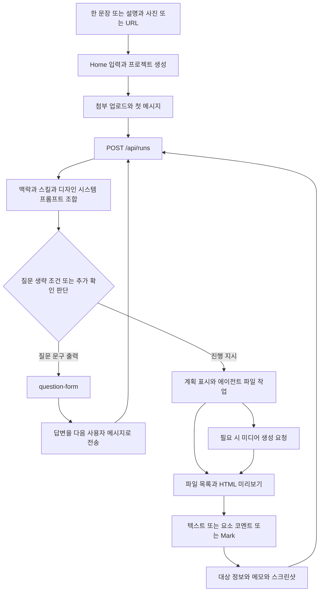
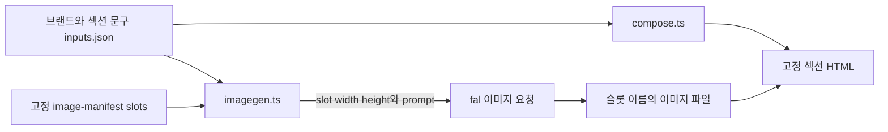

# 최소 입력 기반 사용자 참여 흐름

기준 SHA·범위·검증 수준은 [README](README.md)를 따른다. 아래의 “구현”은 실행을 확인했다는 뜻이 아니라 소스에서 연결을 확인했다는 뜻이다. 근거 번호는 [카탈로그](reference-catalog.md)로 연결된다.

## 1. 확인된 주 경로

F는 서버의 confidence 분류기가 아니라 주로 **프롬프트 규칙을 읽은 모델의 판단**이다. UI가 질문 폼을 표시하고 답변을 다음 메시지로 보내는 부분은 코드다. 도식에 계획 승인·대표 시안 승인 관문을 삽입하지 않았다. 일반 디자인 흐름에는 이를 매번 강제하는 단계 계약을 확인하지 못했다. [R03](reference-catalog.md#r03) [R04](reference-catalog.md#r04) [R05](reference-catalog.md#r05)

실제 호출은 `HomeView.submit → onSubmit → App 프로젝트 생성/업로드 → ProjectView 초기 pendingPrompt 전송 → handleSend → providers/daemon.streamViaDaemon → POST /api/runs → registerRunRoutes → startChatRun → composeSystemPrompt 및 런타임 실행`이다. 최종 provider 함수명과 경로는 [R02](reference-catalog.md#r02)를 따른다. 저장 코멘트·Mark는 같은 실행 진입점으로 돌아온다.

## 2. 세 입력 유형은 무엇까지 지원하는가

| 시작 입력 | 실제 접수·전달 | 의도·사실·시각 해석의 확인 수준 | 막힘·한계 |
| --- | --- | --- | --- |
| 짧은 설명 + 상품 사진 | Home은 prompt와 stagedFiles를 함께 전송하고 프로젝트 생성 후 파일 업로드. 프로젝트 상대 경로와 첨부 순서가 다음 프롬프트에 포함됨 | 이미지가 시각 레퍼런스라는 지시가 있음. 파일 읽기/비전은 선택 CLI·실행 모드에 의존. 상품명·판매 대상·가격·확정 사양을 별도 검증 스키마로 추출하는 일반 경로는 미확인 | Home 업로드 일부 실패는 성공 첨부만 모으고 경고/분석 이벤트를 남김. “필수 상품 사진이 빠졌으니 제작 중단”하는 공통 관문은 이 부분에서 확인되지 않음 |
| 기존 상품·서비스 URL | URL을 프롬프트에 넣는 방식. 일반 페이지 입력의 독립 product-URL DTO는 없음 | discovery는 참고 사이트/CSS/브랜드 가이드 수집과 `brand-spec.md` 작성 지시. 별도 브랜드 추출에는 HTML/CSS·로고·문구를 모으는 구현이 있음 | 브랜드 자료 추출과 상품 사실 검증은 다름. 일반 채팅 URL이 브랜드 수집기로 자동 연결되는 것은 확인되지 않음. 도구 없는 API 모드에서는 URL 읽기를 못 하므로 필요한 정보를 질문하도록 안내 |
| 간단한 제작 요청 한 문장 | 텍스트만으로 제출 가능 | 새 요청 기본 discovery, 사용자 바로 제작 지시/metadata/memory 예외, 디자인 방향 자동 선택 지시가 있음 | 한 문장에서 설득 구조·필요 이미지 수를 일관되게 추출한다는 실행 검증 없음. 필드별 추론 출처·불확실성을 저장하는 페이지용 공통 계약 미확인 |

근거: [R01](reference-catalog.md#r01) [R03](reference-catalog.md#r03) [R07](reference-catalog.md#r07). 세 입력을 모두 채우도록 요구하는 동일한 전용 위저드를 발견한 것이 아니다. **일반 채팅+첨부를 통해 수용되는 세 사용 방식**으로 읽어야 한다.

사진은 상품 증거와 스타일 레퍼런스를 겸할 수 있지만 `official-system.ts`는 주로 palette/layout/tone 레퍼런스로 안내한다. 상품 정체성·사실 보존을 입증하는 별도 테스트로 오해하지 않는다. 첨부 상대경로 필터는 프로젝트 범위/존재 확인이며 내용의 진실성 검증이 아니다. [R01](reference-catalog.md#r01)

## 3. 추가 질문과 바로 제작

| 조건 | 코드에 담긴 지시·동작 | 강제 수준 |
| --- | --- | --- |
| 새 디자인, 일반 기본값 | 한 줄 설명과 discovery/task-type 질문 폼을 먼저 내고 턴 종료. 풍부한 입력에도 기본적으로 질문 | 모델 프롬프트; 질문 문구/구조 테스트 존재 |
| 이미 답한 필드 | project metadata와 plugin inputs를 답으로 취급해 재질문 생략; task-type 답 뒤 discovery 중복 금지 | 프롬프트와 테스트 |
| 기존 디자인의 명확한 수정 / 사용자의 “질문 없이 제작” | discovery 생략 후 진행 | 프롬프트 예외 |
| `metadata.skipDiscoveryBrief=true` | 직접 계획/제작, 안전하게 추론 불가능한 필수 사항만 짧게 질문 | 서버 프롬프트 삽입 순서 테스트; Home 기본 스위치라고 단정하지 않음 |
| memory가 충분하고 rewrite 활성 | 의도를 확장한 접힌 `task-brief` 카드로 discovery를 대체하고 확인 대기 없이 계속 | 조건부 프롬프트; 객관적 충분성 판별기는 미확인 |
| 참고 출처를 골랐지만 실제 자료 없음 | 자료를 요청하고 중단, 도메인/브랜드 토큰을 만들어내지 않음 | 프롬프트 |
| 영역 수정을 위해 다른 페이지/전역 스타일 변경 필요 | 범위 밖을 수정하기 전에 질문 | 주석 프롬프트; 파일 diff 검증으로 강제한 것은 아님 |

[R03](reference-catalog.md#r03) [R10](reference-catalog.md#r10). memory 예외는 본문 중 기본 discovery를 명시적으로 대체하지만 실제 모델이 상충 지시를 항상 해소하는지는 실행 미검증이다. 자동화 예외와 media-only 예외를 랜딩 기본 동작으로 일반화하지 않는다.

질문 폼은 모델이 assistant text에 출력한다. `splitOnQuestionForms`/스트리밍 파서 → QuestionsPanel/QuestionForm → `formatFormAnswers` → `ProjectView.handleSend`로 연결된다. 답은 `[form answers — id]`와 선택값이 담긴 텍스트이며 원래 중단된 도구 호출의 반환값이 아니다. `startChatRun`은 이 마커에 맞는 override를 붙인다. 새 실행과 기존 대화/세션 맥락으로 이어진다. [R04](reference-catalog.md#r04)

`sessionMode=plan`은 Markdown 계획 문서 작업 모드다. 페이지 생성 전 계획 승인 트랜잭션과 동의어가 아니다. [R05](reference-catalog.md#r05)

## 4. 페이지와 이미지 계획의 실행 연결

일반 페이지의 계획은 TodoWrite 항목, 화면/섹션 목록, 디자인 시스템·템플릿 참조 지시다. 선택된 DESIGN.md가 토큰을 정하고 craft는 사용 규칙, SKILL.md는 구체적 작업 순서를 제공한다. 모델은 seed template과 콘텐츠를 수정해 HTML을 만든다. 일반 `ChatRequest`에는 `pagePlan`, `imageSlots`, 승인된 사실 집합 같은 페이지 전용 구조가 없다. **계획이 사용자에게 보인다는 사실만으로 이미지 실행 인자가 보존된다고 볼 수 없다.** [R02](reference-catalog.md#r02) [R05](reference-catalog.md#r05) [R15](reference-catalog.md#r15)

작동 원리를 좁게 추적할 수 있는 예외는 `design-templates/open-design-landing`이다. [R06](reference-catalog.md#r06)

- `schema.ts`는 콘텐츠 타입, manifest는 16개 슬롯의 ID/파일명/width/height/ratio/required 등을 기록한다.
- `imagegen.ts`는 style anchor+브랜드+슬롯 prompt를 합치고 **width/height를 실제 `image_size`**로 보낸다. `--only`로 일부, `--force`로 기존 파일 재생성을 선택한다.
- `compose.ts`는 입력을 TypeScript 타입으로 단언하여 읽고 정해진 파일명을 HTML에서 참조한다. 타입 선언 자체가 런타임 입력 검증은 아니다.
- 이미지 수·섹션 형태가 고정이고 SKILL은 8개 질문 그룹을 요구한다. 현재 목표의 최소 입력·가변 상품 구성에 그대로 맞는 참고 구현은 아니다.
- `ratio`, `required`, `rekey_on_brand_change` 필드의 존재를 자동 검증·브랜드 변경 시 자동 무효화의 증거로 쓰지 않는다. 확인한 생성 루프는 파일 존재 시 생략하고 `--force`로 덮어쓴다.

일반 미디어 실행의 `model/prompt/aspect/image/images/output`은 실제 dispatcher에 연결되지만 이것을 페이지 계획과 묶어 강제하는 layer는 별도다. 생성 비율, 출력 픽셀 크기, HTML 표시 크기·crop 역시 서로 다른 결정이다. [R12](reference-catalog.md#r12)

## 5. 영역 코멘트·Mark·Edit는 구별해야 한다

| 표면 | 수집 데이터 | 실행으로 가는 길 | 이번 확인의 한계 |
| --- | --- | --- | --- |
| HTML 요소/묶음 코멘트 | filePath, elementId, selector, position, htmlHint, currentText, style, podMembers, note, 참고 이미지 | 코멘트 저장 API → 선택 항목을 채팅 task로 보냄 | CSS/문구 수정 대상을 구체화하지만 원본 이미지 픽셀 마스크가 아님 |
| HTML Mark/Draw | 클릭 박스·펜 표시가 합성된 PNG, bounds, markKind, note, 선택 대상 정보 | `PreviewDrawOverlay.send → ANNOTATION_EVENT → ChatComposer → handleSend` | 모양은 스크린샷의 표시. 좌표는 미리보기/대상 맥락이며 원본 이미지 좌표와 동일하다는 계약 없음 |
| 수동 Edit | `set-text`, `set-link`, `set-image`의 src/alt, 스타일/HTML patch | `manualEditContentPatchForDraft → applyManualEdit`로 HTML 저장 | AI 인페인팅이 아님. 명확한 편집을 모델 없이 처리하는 별도 경로 |
| 독립 이미지 파일 뷰어 | 이미지 표시·다운로드·열기 | `ImageViewer` | 해당 컴포넌트에는 Mark/수동 편집 UI가 연결돼 있지 않음 |

[R08](reference-catalog.md#r08) [R09](reference-catalog.md#r09).

코멘트 수정의 자세한 흐름:

1. 미리보기에서 얻은 대상을 `PreviewCommentTarget`으로 저장한다. 저장 코멘트는 프로젝트/대화에 귀속된다.
2. `handleSendBoardCommentAttachments`는 각 코멘트를 별도의 queue task로 보내며 메모를 실제 사용자 질의로 승격한다. `commentContext=query`로 중복 명령을 피하고 대상 맥락은 별도 유지한다.
3. daemon의 `normalizeCommentAttachments`는 요소 코멘트에 selector, visual 코멘트에 screenshotPath를 요구한다. 텍스트/HTML 힌트는 짧게 제한하고 순서를 정규화한다.
4. `renderCommentAttachmentHint`가 대상과 메모를 프롬프트에 넣는다. 명확한 수정은 바로 진행 가능한 구조이고, 범위를 넘을 때 질문하도록 지시한다. 수정안 JSON을 항상 먼저 생성·승인시키는 경로는 확인하지 못했다.
5. 파일 변경·실행 종료 후 목록과 미리보기를 갱신한다. 연결된 저장 코멘트는 성공 시 `needs_review`, 실패 시 `failed`. 이것은 변경 내용이 적절하다는 자동 판정이 아니다.

[R10](reference-catalog.md#r10) [R11](reference-catalog.md#r11). 자유 Mark는 저장 코멘트와 계약 일부를 공유하지만 동일한 DB 코멘트 수명주기를 항상 갖는다고 보지 않는다.

## 6. 실패·중단·재확인의 경계

| 사건 | 확인한 처리 | 사용자가 알아야 할 경계 |
| --- | --- | --- |
| 마크 스크린샷 실패 | 글/추가 이미지가 있으면 그것으로 전송 가능, 표시만 있고 대체 자료가 없으면 경고와 차단 | 텍스트 전달 성공과 영역 픽셀 전달 성공은 다름 |
| 작업 중 피드백 | Send/Queue/Draft 분기, queue 보존 및 이후 전송 | 실행 중인 모델에 같은 호출로 주입하는 것과 다름; 저장 코멘트 batch는 코멘트별 task |
| SSE 연결 종료 | 브라우저 구독 중단과 사용자의 cancel 분리, event ID로 재연결 | daemon run은 in-memory Map이므로 JSONL 로그가 있다고 자동 재시작 복구를 보장하지 않음 |
| 사용자 cancel | 실행 취소·프로세스 종료 처리 | 이미 변경한 파일/이미지 비용을 원복한다는 뜻 아님 |
| 자동 재시도 | 부작용 없고 지원하는 일시 오류에 기본 최대 1회 | 파일/도구 실행 후의 무조건 재시도와 다름 |
| 결과 되돌리기 | HTML 버전 목록·미리보기·restore, 복원을 새 버전으로 기록 | 외부 이미지 파일의 이전 바이트까지 함께 복원하는 page bundle 기능은 확인하지 못함 |

[R09](reference-catalog.md#r09) [R11](reference-catalog.md#r11) [R13](reference-catalog.md#r13) [R15](reference-catalog.md#r15).

## 7. 이미지 적절성 피드백에서 아직 닫히지 않은 연결

사용자의 “이 제품이 아니다”, “오른쪽 부분만 바꿔 달라”, “더 넓게” 같은 문장은 텍스트/영역 맥락으로 전달 가능하다. 미디어 생성에 모델·비율·원본 이미지 경로를 보낼 수도 있다. 하지만 **의견 분류 → 모델/비율/내용 변경 결정 → 원본 보호 → 후보 비교 → 채택** 전체를 페이지별 구조화 상태로 강제하는 통합 경로는 조사 범위에서 확인하지 못했다.

공통 API에 mask가 없고, OpenAI 직접 이미지 renderer는 확인한 요청 본문에서 `imageRef`를 보내지 않는다. 다른 renderer(예: fal)는 참조 이미지를 전달하는 코드가 있다. 모델 카탈로그의 `inpaint` capability 표시는 주석에서 provider까지의 마스크 연동 증거가 아니다. 이미지 전후 비교·확정 방식은 [후속 질문](findings-and-questions.md)에 남겼다. [R12](reference-catalog.md#r12) [R13](reference-catalog.md#r13)

Self-check, craft, 선택적 Design Jury도 존재하지만 범용 픽셀 검수와 같은 뜻은 아니다. 특히 Jury는 기본 비활성이고 현재 분기에서 plain adapter·브랜드·스킬·비미디어 조건을 요구한다. 페이지에 실제 적용된 이미지가 의도/사실에 맞는지는 이번 정적 분석으로 입증하지 않았다. [R14](reference-catalog.md#r14)
