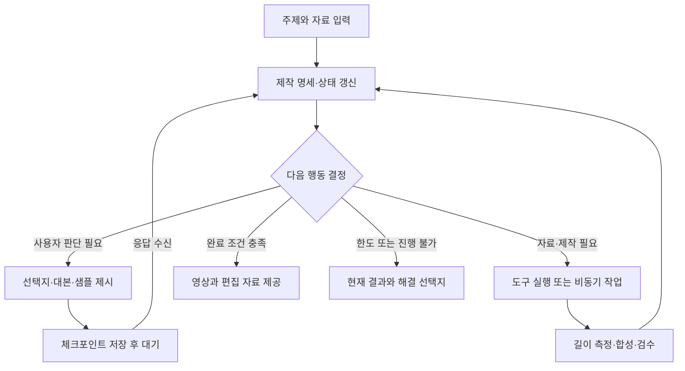

# 숏폼·릴스 제작 가이드

## Human-in-the-loop Agentic Workflow 기반 제품·제작·실행 설계

- 버전: 1.0
- 작성일: 2026-09-20
- 기반 문서: `plant-cardnews-human-in-the-loop-workflow.md` v1.1
- 적용 범위: 주제 입력부터 대본, 콘티, 영상·음성·자막 제작, 편집, 검수, 부분 수정과 파일 제공까지 수행하는 웹 서비스.
- 문서 성격: 구현에 활용할 설계 가이드. 영상 제작이나 외부 게시를 실행한 결과물은 아니다.
- 콘텐츠 범위: 일반적인 숏폼·릴스 제작에 적용하며, 식물 콘텐츠를 구체적인 예시로 사용한다.
- 기술 전제: 모델·제공업체·편집 엔진에 종속되지 않는다. 도구명, JSON, 기본값과 품질 기준은 본 서비스용 제안이다.

## 1. 제품 목표와 핵심 차이

사용자가 “초보자가 식물을 들이고 싶어지는 릴스 만들어줘”처럼 주제를 전달하면, 에이전트가 필요한 선택만 요청하고 제작 도구를 호출해 완성 영상을 제공한다.

전체 구조는 사용자 참여형 에이전틱 워크플로다. 고정된 제작 단계 안에서 모델이 다음 행동을 선택하고, 중요한 선호나 조건이 불명확하면 실행을 중단해 사용자 입력을 받는다. 도구 결과와 실제 출력물을 검수하며 목표에 도달할 때까지 제한된 범위에서 반복한다.

| 카드뉴스의 설계 대상 | 숏폼·릴스에서 추가되는 설계 대상 |
| --- | --- |
| 장별 정보 구성 | 시간에 따른 정보 공개, 훅과 전개, 결말 |
| 이미지와 카피의 관계 | 영상·화면 문구·발화·효과음의 동기화 |
| 서체·크기·줄바꿈 | 노출 시간, 읽는 속도, 움직이는 배경 위의 가독성 |
| 사진의 일관성 | 장면 간 피사체·색감·공간·동작의 연속성 |
| 카드별 부분 수정 | 타임라인 의존성과 수정 후 재동기화 |
| 정적인 출력 검사 | 전체 재생, 음성 청취, 전환·프레임·오디오 검사 |

핵심 산출물은 하나의 영상 파일과 함께, 재편집할 수 있는 **대본·장면·음성·자막·타임라인의 구조화된 프로젝트**다. 모델 내부 추론은 저장 대상이 아니며 결정, 근거, 사용자 선택, 도구 결과와 작업 상태를 기록한다.

## 2. 제작 원칙

1. 주제와 목적을 먼저 이해하고, 중요한 불확실성만 질문한다.
2. 메시지·장면·발화·화면 문구를 함께 기획한다.
3. 고비용의 전체 생성 전에 대본·콘티와 짧은 제작 샘플을 확인한다.
4. 대본 길이는 추정하되 최종 타이밍은 실제 음성·영상 길이로 정한다.
5. 읽을 시간과 들을 시간을 편집 리듬에 포함한다.
6. 이미지·영상 자산, 카피, 자막, 음성, 음악, 합성 설정을 분리해 관리한다.
7. 검수는 정상 속도 재생과 실제 소리까지 포함한다.
8. 부분 수정은 영향받는 구간과 의존 자산에만 전파한다.
9. 자동 위임과 문구·목소리·영상 길이 잠금을 함께 지원한다.
10. 완성 파일 생성과 SNS 게시를 별개의 작업·권한으로 취급한다.

## 3. 제작 유형과 초기 선택

### 3.1 콘텐츠 유형

| 유형 | 주요 구성 | 중요한 선택·검수 |
| --- | --- | --- |
| 정보·교육형 | 질문 또는 오해 → 설명 → 정리 | 근거, 용어, 발화·자막의 정보량 |
| 상품 소개형 | 관심 유도 → 특징 → 사용 맥락 → CTA | 실제 상품 일치, 과장 없는 카피 |
| 브랜드·감성형 | 분위기 → 시각적 변화 → 짧은 메시지 | 음악·색감·서체·모션의 일관성 |
| 실제 촬영 편집형 | 제공 영상의 하이라이트와 재구성 | 원본 발화·동작의 의미 보존 |
| 진행자형 | 인물 발화와 보조 장면 | 인물·목소리 일관성, 입 모양과 음성 |
| 모션 그래픽형 | 텍스트·도형·이미지의 시간 기반 연출 | 읽는 시간, 정보 위계, 움직임의 목적 |

하나의 유형이 모든 주제에 적합하다고 가정하지 않는다. 진행자가 꼭 필요하지 않다면 실제 상품·공간 영상과 내레이션 또는 화면 문구로도 구성할 수 있다.

### 3.2 첫 입력에서 파악할 내용

- 주제, 제작 목적, 대상, 채널, 언어.
- 목표 길이와 길이 변경 허용 여부.
- 제공된 사진·영상·상품 링크·브랜드 자료.
- 사람 출연 여부와 제작 방식: 제공 영상, 생성 영상, 이미지 모션, 혼합.
- 음성 사용 여부, 말투, 음악 분위기.
- 반드시 포함·제외할 문구, 자산, 표현.

모든 항목을 처음부터 설문으로 묻지 않는다. 이미 명확한 정보는 재질문하지 않고, 낮은 영향의 미정 항목은 추천값으로 표시한다.

### 3.3 질문 예시

질문: **“어떤 반응을 얻고 싶으세요?”**

| 선택 | 결과에 반영할 방향 |
| --- | --- |
| 저장하고 다시 보기 | 정보와 체크리스트 중심 |
| 상품을 더 알아보기 | 실제 상품의 특징과 탐색 CTA 중심 |
| 분위기와 브랜드 기억하기 | 시각·음악·짧은 카피 중심 |

‘직접 입력’과 ‘알아서 추천’을 별도 제공한다. 목적이 정해졌다면 필요한 경우 “목소리로 설명할까요, 화면 문구 중심으로 만들까요?”처럼 제작 방식에 큰 영향을 주는 질문만 추가한다.

## 4. 사용자 참여 지점

| 지점 | 제시할 결과 | 사용자의 선택 | 자동 위임 시 처리 |
| --- | --- | --- | --- |
| 방향 설정 | 목적·대상·길이·형식 요약 | 방향 선택 또는 조건 변경 | 가정을 기록하고 진행 |
| 기획 | 훅 후보, 대본, 장면 구성 | 카피·내용·흐름 수정 | 검수 통과 후 진행 |
| 샘플 | 대표 5~8초 클립과 목소리·자막 | 분위기·음성·가독성 판단 | 추천안으로 진행 |
| 초벌 편집 | 처음부터 끝까지 이어지는 영상 | 시간 구간별 피드백 | 필수 검수와 제한적 보정 |
| 완성본 | 최종 영상·커버·문구 | 다운로드 또는 후속 수정 | 파일 제공 후 제작 종료 |

5~8초는 서비스의 샘플 길이 예시다. 전체 길이가 매우 짧거나 초벌 편집만으로 충분하면 샘플 단계를 합칠 수 있다. 샘플은 실제 사용할 카피·음성·자막과 대표 움직임을 포함해야 한다.

기본 모드에서는 영향이 큰 선택만 요청한다. 단계별 확인 모드와 자동 위임 모드는 선택 옵션으로 둔다. 한 번 확정한 조건은 작업마다 다시 승인받지 않는다. 잠긴 조건을 바꾸거나 남은 예산을 늘려야 할 때에는 필요한 변경만 요청한다.

## 5. 전체 실행 루프



사용자 응답 대기 중에는 모델을 호출하지 않는다. 영상 생성 대기는 `waiting_tool`, 사용자 선택 대기는 `waiting_user`로 구분한다. 결과가 도착하면 현재 프로젝트 버전과 연결된 요청인지 확인한 뒤 다음 단계로 진행한다.

## 6. 단계별 제작 가이드

### 6.1 요청 해석과 자료 조사

명시된 조건, 사용자가 확정한 조건, AI가 가정한 조건을 분리한다. 제공 자료의 실제 내용·해상도·길이·오디오·사용 조건을 확인한다. 정보성 주장은 출처를 연결하고, 특정 식물·상품의 이름과 제공 자산이 일치하는지 검토한다.

자료가 부족하면 추가 검색·상품 조회·업로드 요청 중 필요한 행동을 선택한다. 선호 질문으로 사실관계의 불확실성을 해결하지 않는다.

### 6.2 메시지와 대본

목적에 따라 훅 → 전개 → 보상 또는 정리 → CTA를 설계한다. 이는 활용 가능한 구성 틀이며 모든 영상에 같은 순서나 시간을 강제하지 않는다.

- **훅:** 다음 장면을 볼 이유를 제시하고 본문에서 그 약속을 충족한다.
- **전개:** 한 장면에서 전달할 메시지를 분명히 한다.
- **보상:** 시청자가 얻는 정보·비교·변화를 보여준다.
- **CTA:** 목적에 맞는 행동 하나를 우선한다. CTA가 필요 없는 영상에는 강제로 넣지 않는다.

발화 대본, 강조 문구, 설명용 화면 텍스트를 구분한다. 숫자·고유명·식물명·단위를 교정하고, 자막만 읽어도 부정어·조건이 누락되지 않게 한다. 훅 후보는 소수만 만들고 내용의 차이를 비교한다.

### 6.3 콘티와 장면 명세

각 장면에 `scene_id`, 역할, 예정 시간, 피사체, 행동, 카메라·프레이밍, 자산 출처, 발화, 화면 문구, 자막, 전환, 사운드를 기록한다.

생성 영상 프롬프트에는 원하는 움직임과 보존할 특징을 구분한다. 식물의 잎 형태·무늬·화분·상품 라벨처럼 중요한 특성을 명시하고, 자막이 들어갈 공간도 구도에 반영한다. 식물 품종이나 상품 동일성을 생성 프롬프트만으로 보장한다고 가정하지 않는다.

### 6.4 목소리와 시간 확정

내레이션형은 검토한 대본으로 음성을 생성하고 실제 길이·쉼·발음을 측정한 뒤 장면 시간을 조정한다. 실제 인물 영상은 원본 발화와 입 모양을 우선 보존한다. 음악 중심 영상은 음악의 구조와 읽을 시간을 함께 기준으로 삼는다.

대본이 길면 중복 제거 → 의미를 보존한 재작성 → 허용 범위의 말하기 속도 조정 → 장면 시간 재배분 순으로 검토한다. 확정된 길이나 잠긴 문구를 바꿔야 하면 선택을 요청한다. 발음을 과도하게 빠르게 하거나 말끝을 잘라 길이를 맞추지 않는다.

### 6.5 시각 자산과 샘플 제작

가능한 자산은 실제 영상, 상품 원본 사진, 이미지 기반 모션, 생성 영상, 도형·텍스트 모션이다. 메시지에 맞게 조합하며 모든 장면을 생성 영상으로 만들 필요는 없다.

대표 샘플에서 피사체 일관성, 색감, 모션, 음성, 자막 가독성을 함께 확인한다. 가장 화려한 장면뿐 아니라 정보가 가장 많은 구간도 확인한다. 스타일이 확정되면 독립된 장면을 제한된 동시성으로 제작한다.

### 6.6 초벌 편집과 최종 합성

실제 길이를 확인한 자산을 타임라인에 배치한다. 빈 구간, 의도치 않은 겹침, 잘린 발화, 불필요한 반복을 먼저 정리한다. 이후 화면 문구·자막·전환·음악·효과음을 합성한다.

사용자는 재생 위치를 선택해 “이 구간을 더 짧게”, “이 장면 자막이 안 보여”처럼 피드백한다. 최종 렌더링 전에는 저해상도 초벌 편집을 활용할 수 있지만, 최종 파일 자체의 검수를 생략하지 않는다.

## 7. 식물 릴스 30초 예시

### 제작 명세

- 요청: “책상 위에 식물 하나 두고 싶어지는 릴스 만들어줘.”
- 목적: 분위기와 관심 유도. 가격·구매 CTA는 제외.
- 형식: 식물·공간 중심 영상, 부드러운 내레이션, 짧은 강조 문구.
- 길이: 30초 목표, 9:16 세로형, 30fps 제작 프리셋.
- 콘셉트: 빈 책상의 한 자리가 초록으로 채워지는 변화.
- 근거 범위: 미적 연출 예시이며 공기 정화·건강·관리 난이도 등 효능을 주장하지 않는다.

### 콘티 예시

| 시간 | 화면·움직임 | 내레이션 초안 | 화면 강조 문구 | 편집 의도 |
| --- | --- | --- | --- | --- |
| 0~3초 | 빈 책상의 한 자리를 보여주며 천천히 접근 | “책상 위, 한 자리가 비어 있나요?” | 여기, 초록 하나 | 질문과 시각적 빈자리 연결 |
| 3~8초 | 같은 위치에 식물이 놓인 전후 컷 | “식물 하나로, 공간의 표정을 바꿔보세요.” | 작은 자리의 변화 | 동일 구도로 변화를 전달 |
| 8~13초 | 잎의 결을 보여주는 근접 컷 | “가까이 보면, 잎마다 다른 선이 보여요.” | 잎의 선과 결 | 제품·식물 디테일 관찰 |
| 13~19초 | 같은 식물의 전체 실루엣과 책상 구도 | “가까이서도, 조금 떨어져서도 바라보고요.” | 가까이, 그리고 멀리 | 관점 변화와 리듬 형성 |
| 19~25초 | 식물·화분 후보를 동일한 촬영 조건으로 비교 | “잎의 모양과 화분의 색. 어떤 조합이 좋으세요?” | 나의 초록 취향 | 시청자의 선호 선택 유도 |
| 25~30초 | 첫 책상 구도로 복귀하며 마무리 | “당신의 책상에는 어떤 초록이 어울릴까요?” | 마음에 드는 조합을 저장해두세요 | 질문과 저장 CTA로 마무리 |

시간은 합계 30초의 기획안이며, 음성 생성·청취로 검증된 시간표가 아니다. 실제 발화와 쉼을 측정한 뒤 장면 길이를 다시 배분한다. 같은 식물을 계속 보여주는 구간에서는 종·무늬·화분을 일치시키고, 후보 비교 구간에서는 대상이 바뀌었음을 명확히 한다.

발화 자막은 내레이션과 동기화하고, 표의 강조 문구와 다른 역할·위치로 표시한다. 동시에 읽을 내용이 많아지면 강조 문구를 줄이거나 발화가 없는 시점으로 옮긴다.

## 8. 화면 문구·자막·타이포그래피

### 8.1 텍스트 역할 분리

| 텍스트 유형 | 역할 | 검수 기준 |
| --- | --- | --- |
| 훅·장면 제목 | 시선과 주제 안내 | 시작 시점·노출 시간·강조 위계 |
| 발화 자막 | 실제 발화 전달 | 정확성·누락·발화 타이밍 |
| 설명·레이블 | 상품명·단계·비교 항목 | 대상 매칭·고유명·단위 |
| CTA | 다음 행동 안내 | 목적과 일치, 충분한 읽기 시간 |

발화 자막과 요약 카피는 별도 데이터로 관리한다. 요약 카피를 정확한 전사 자막으로 표시하지 않는다. 무음으로 보더라도 핵심 메시지를 이해할 수 있는지 별도 확인한다.

### 8.2 시간까지 포함한 타이포그래피 명세

텍스트 객체에 서체·굵기·크기·행간·자간·정렬·색상·박스·줄바꿈과 함께 시작·종료 시간, 등장·퇴장 모션, 강조 구간, 발화 참조를 둔다. 크기와 행 수는 콘텐츠·언어·기기에서 확인할 프리셋으로 관리한다.

- 확정 카피와 식물명·상품명은 잠금과 용어 목록으로 보호한다.
- 글자 수는 초안 작성의 참고값으로 사용하고, 배치는 실제 폰트로 측정한다.
- 모션 중에도 읽을 수 있는 정지 또는 안정 구간을 확보한다.
- 읽기 시간은 텍스트 길이·난이도·동시 정보량으로 판단한다. 모든 문장에 동일한 초당 글자 수를 강제하지 않는다.
- 밝고 어두운 장면을 모두 확인하고 필요시 배경 패널·외곽선·위치를 조정한다.
- 화면 문구와 자막이 피사체·상품 특징·플랫폼 버튼을 가리지 않게 한다.
- 안전 영역은 플랫폼·배치·앱 UI 버전별 프로필로 관리한다. 고정된 한 개의 좌표를 모든 릴스·쇼츠 화면에 보장값으로 쓰지 않는다.

### 8.3 자막 생성·동기화

최종 사용할 음성 트랙을 전사·정렬하고 대본과 대조한다. 대본의 추정 시간을 자막 타임코드로 그대로 사용하지 않는다. 잘못 발음한 고유명은 자막만 고치지 않고 음성 수정 필요 여부도 판단한다.

편집으로 클립을 잘라내거나 속도를 바꾸면 해당 시간 변환을 자막·강조 타이밍에 적용하고, 최종 음성 기준으로 다시 확인한다. OCR·전사·정렬 결과는 보조 검수 자료이며 실제 재생 확인을 대체하지 않는다.

SRT/VTT에는 발화 텍스트와 타이밍을 제공할 수 있지만, 영상에 합성한 키워드 모션·서체 효과까지 동일하게 보존된다고 보장하지 않는다. 편집 가능한 스타일·모션은 프로젝트 데이터에 보관한다.

## 9. 영상·모션·사운드 설계

### 영상과 편집

- 각 장면은 메시지·비교·관찰 중 명확한 역할을 가진다.
- 카메라 움직임, 피사체 움직임, 텍스트 모션을 구분한다.
- 전환은 시점·주제·시간의 변화에 사용한다. 모든 컷에 이펙트를 넣지 않는다.
- 동일 식물·상품을 연결할 때 형태·색·무늬·라벨·화분의 연속성을 확인한다.
- 생성 영상은 정지 이미지가 좋아도 중간 프레임에서 변형될 수 있으므로 움직임 전체를 검토한다.
- 마지막 장면을 시작과 연결하는 반복 구조는 선택 사항이다. 미완성 발화나 불필요한 반복으로 길이를 맞추지 않는다.

### 음성·음악·효과음

- 목소리 ID·발음 사전·말투·속도 설정을 보관한다. 장면별 생성 시 음색·음량의 일관성을 듣고 확인한다.
- 내레이션의 실제 발화 구간에서 음악을 낮추는 믹싱을 적용하고 단어가 묻히지 않는지 확인한다.
- 음량·피크·클리핑·무음 구간을 측정하고 이어폰과 작은 스피커에 가까운 청취 환경에서 점검한다.
- LUFS·피크 목표는 납품 프로필로 명시한다. 하나의 수치를 모든 SNS의 필수 표준이라고 단정하지 않는다.
- 효과음은 동작·전환·강조의 시점에 연결하고 자막 읽기를 방해하지 않게 한다.
- 외부 음원과 목소리는 출처·사용 범위·허용 채널을 기록한다. 플랫폼 내 음원을 다른 플랫폼용 파일에 자동 재사용하지 않는다.

내레이션 없는 영상은 음성·전사 단계를 생략한다. 의도된 무음 영상은 오류로 취급하지 않는다.

## 10. 웹 UI 구성

| 영역 | 주요 기능 | 설계 포인트 |
| --- | --- | --- |
| 시작 | 주제·참고 자료 입력 | 짧은 요청으로 시작 |
| 제작 대화 | 선택지·진행 요약·자연어 수정 | 이미 정한 내용은 반복 질문하지 않음 |
| 제작 명세 | 목적·길이·형식·목소리·스타일 | 명시·확정·추천 조건 구분 |
| 대본·콘티 | 장면별 대본·문구·예상 길이 | 발화와 화면 텍스트를 분리 |
| 샘플 비교 | 같은 구간의 음성·자막·스타일 비교 | 비교할 요소만 바꾸는 모드 제공 |
| 플레이어 | 재생·정지·구간 반복·무음 확인 | 모바일 크기와 플랫폼 UI 오버레이 |
| 장면 목록 | 구간별 썸네일·버전·검수 상태 | 전문 편집기 지식 없이 장면 선택 |
| 간단 타임라인 | 장면·발화·자막·음악 표시 | 고급 편집은 필요할 때 펼치기 |
| 피드백 | 재생 위치·구간에 코멘트 | 현재 컷의 버전에 연결 |
| 결과 | 최종 영상·커버·자막·프로젝트 | 부분 수정과 다운로드 |

“12~16초 자막을 더 크게”라는 요청은 당시 타임라인 버전과 구간, 해당 `scene_id`·`text_id`에 연결한다. 후속 편집으로 시간이 이동하면 원래 참조 대상을 추적하고 대응이 불명확할 때만 다시 확인한다.

진행 메시지는 “목소리 길이에 맞춰 장면을 조정하고 있어요”, “후반부 자막이 빨라 노출 시간을 늘리고 있어요”처럼 실제 작업을 반영한다. 비공개 추론·가짜 진행률·내부 API 인자를 제품 화면에 표시하지 않는다.

## 11. 실행 아키텍처와 도구

### 역할 분리

| 구성 요소 | 책임 |
| --- | --- |
| 웹 클라이언트 | 입력·선택·재생·피드백·상태 복원 |
| 프로젝트 API | 접근 권한, 입력 검증, 프로젝트·실행 생성 |
| 실행 조정기 | 다음 행동 선택, 도구 호출, 상태 전이, 예산 관리 |
| 모델 | 의도 해석, 대본·콘티·편집안, 검수 결과 해석 |
| 비동기 워커 | 이미지·영상·음성 생성과 렌더링 |
| 타임라인 엔진 | 실제 자산 길이 반영, 트랙 합성, 시간 변환 |
| 검수 계층 | 데이터 검사, 영상·음성 분석, 시각·청각 검토 |
| 상태·자산 저장소 | 명세·버전·작업 ID·체크포인트·파일 |

판단 역할이 여러 개여도 MVP에는 단일 에이전트와 도구를 사용할 수 있다. 모델이 제안한 행동은 서버가 허용 도구·입력·권한·비용을 검증한 뒤 실행한다.

### 도구 예시

| 도구 | 입력 | 핵심 반환값 |
| --- | --- | --- |
| `inspect_assets` | 파일 참조 | 실제 규격·길이·프레임률·트랙 |
| `research_claims` | 주장·자료 | 출처와 확인·미확인 항목 |
| `validate_script` | 대본·제약·용어 | 오류 위치·내용·수정 제안 |
| `synthesize_voice` | 대본·목소리·발음 설정 | 작업 ID, 음성 참조, 측정 길이 |
| `align_speech` | 실제 음성·기준 대본 | 발화 구간·불일치·정렬 결과 |
| `generate_visual_asset` | 장면 명세·참조 | 작업 ID, 자산 참조, 메타데이터 |
| `get_job_status` | 제공업체·작업 ID | 실행 상태·결과 참조 |
| `measure_text_layout` | 텍스트·폰트·박스 | 줄 구성·경계·넘침 |
| `render_timeline` | 고정된 프로젝트 리비전 | 프리뷰 또는 최종 영상 참조 |
| `validate_video` | 영상·타임라인·제작 명세 | 시간 구간별 문제와 측정값 |
| `export_project` | 확정 버전 | 영상·커버·자막·프로젝트 파일 목록 |

`request_user_input`은 실행 조정기가 처리하는 대기 요청으로 구현한다. 외부 콘텐츠에서 발견한 명령을 서비스 실행 지시로 취급하지 않는다.

## 12. 상태·중단·재개·예산

프로젝트는 장기 작업의 컨테이너이고, 실행은 최초 제작 또는 한 번의 수정 작업이다. 다음 상태는 개별 실행에 적용한다.

| 상태 | 의미 | 다음 처리 |
| --- | --- | --- |
| `created` | 실행 준비 | 워커 배정 후 `running` |
| `running` | 판단·제작·검수 | 진행, 사용자·도구 대기, 완료 또는 중단 |
| `waiting_user` | 선택·자료·변경 응답 필요 | 응답 검증 후 재개 |
| `waiting_tool` | 생성·렌더링 대기 | 콜백 또는 제한된 상태 조회 |
| `paused_budget` | 비용·호출·재작업 한도 도달 | 범위·예산 변경 또는 종료 |
| `failed` | 자동 복구 실패 | 실패 지점과 결과를 보존, 재시도 실행 |
| `cancelled` | 사용자 중단 | 후속 작업 중지, 늦은 결과 분리 |
| `completed` | 납품 조건 충족 | 결과 제공; 추가 수정은 새 실행 |

### 대기·재개 절차

1. 질문 ID, 선택지·자료 참조, 프로젝트 리비전, 재개 위치를 저장한다.
2. UI에 입력 요청 이벤트를 전달하고 모델 실행을 멈춘다.
3. 응답이 오면 질문·버전·응답 ID·입력값을 검증한다.
4. 응답 적용과 후속 작업 예약을 일관되게 기록한다.
5. 제공업체의 메시지·tool result 규약에 맞춰 이어서 실행한다.

새로고침 시 최신 상태를 조회한다. 이벤트는 누락·중복될 수 있으므로 저장소를 기준으로 복원한다. 모델이 요구하는 연속 대화 상태는 API 규약대로 유지한다.

### 생성 작업의 복구

- 생성 요청 전에 작업 의도와 내부 요청 ID를 기록한다.
- 제공업체 작업 ID를 확보하면 저장하고, 타임아웃 시 기존 작업부터 조회한다.
- 작업 ID를 받기 전 연결이 끊기면 중복 요청 위험을 구분해 처리한다. 제공업체 지원 없이 외부 실행의 정확히 한 번 수행을 보장하지 않는다.
- 콜백 중복, 취소 후 완료, 구버전 결과 도착을 정상적인 상태 처리 대상으로 설계한다.
- 폴링에는 간격 증가와 최대 대기 시간을 적용한다. 상태 확인에 LLM을 호출하지 않는다.

### 예산 정책

모델 호출·생성 작업 수·생성 초수·예상 비용·재수정 횟수·대기 시간을 각각 제한한다. 사용자 대기와 도구 대기, 실제 처리 시간을 분리해 기록한다. 실행별 제한과 프로젝트 누적 비용을 함께 적용한다.

샘플 확인 후 전체를 생성하고, 동일한 입력·자산·설정의 결과는 유효성을 확인해 재사용한다. 임시 비용 예약을 통해 병렬 작업이 동시에 남은 한도를 초과하지 않게 한다. 제한값은 실제 제공업체 비용과 평가 결과로 결정한다.

## 13. 데이터·타임라인·UI 계약

### 프로젝트 데이터 예시

아래 JSON은 앞의 30초 예시 중 첫 장면만 표시한 부분 명세다. 완성 프로젝트에는 나머지 장면·트랙·자산이 필요하다.

```json
{
  "project_id": "reel_example",
  "revision": 4,
  "run_id": "run_example_04",
  "status": "waiting_user",
  "brief": {
    "topic": "책상 위의 작은 초록",
    "purpose": {"value": "branding", "origin": "user_confirmed"},
    "target_duration_seconds": 30,
    "duration_locked": true,
    "constraints": ["가격 표시 없음", "구매 CTA 없음"]
  },
  "output_profile": {
    "width": 1080,
    "height": 1920,
    "fps_num": 30,
    "fps_den": 1,
    "duration_frames": 900,
    "safe_zone_profile_id": "reels_preview_example_v1"
  },
  "scenes": [
    {
      "scene_id": "scene_01",
      "start_frame": 0,
      "end_frame_exclusive": 90,
      "role": "hook",
      "visual_asset_id": null,
      "narration_id": "voice_01",
      "text_ids": ["hook_01"],
      "status": "planned"
    }
  ],
  "texts": [
    {
      "text_id": "hook_01",
      "role": "headline",
      "content": "여기, 초록 하나",
      "content_locked": true,
      "style_id": "headline_primary",
      "start_frame": 0,
      "end_frame_exclusive": 90
    }
  ],
  "audio_assets": [],
  "subtitle_cues": [],
  "pending_request_id": "sample_choice_01"
}
```

예시의 안전 영역 ID는 서비스 내부 프리셋 이름이며 플랫폼 공식 규격을 뜻하지 않는다. 실제 적용 영역과 확인한 앱 화면 버전을 별도 보관한다.

### 시간 처리 규칙

- 출력 타임라인은 명시한 프레임률과 정수 프레임을 사용하고 구간은 `[start, end)`로 저장한다.
- 원본의 가변 프레임률·서로 다른 프레임률·오디오 시간은 실제 타임스탬프와 변환 규칙을 보존한다.
- 음성 정렬은 밀리초나 샘플 단위의 원본 정확도를 유지하고, 화면 큐 배치 시 지정한 반올림 규칙으로 변환한다.
- 트랜지션의 겹침과 소스 트림은 명시한다. 소스 클립 길이 합계만으로 완성 영상 길이를 판단하지 않는다.
- 의도한 공백·무음·중첩은 허용 표시를 두고 누락과 구분한다.
- 자막 스타일만 변경하면 음성을 재생성하지 않는다. 음성·편집 시간이 바뀌면 관련 정렬을 다시 검수한다.

### 사용자 선택 계약 예시

```json
{
  "type": "request_user_input",
  "request_id": "sample_choice_01",
  "project_revision": 4,
  "component": "video_compare",
  "question": "어떤 자막 분위기가 더 잘 어울리나요?",
  "options": [
    {"value": "calm", "label": "차분한 문장형", "preview_asset_id": "preview_a"},
    {"value": "emphasis", "label": "핵심 단어 강조형", "preview_asset_id": "preview_b"}
  ],
  "allow_free_text": true,
  "allow_delegate": true
}
```

응답에는 `request_id`, `project_revision`, 중복 처리를 위한 `response_id`, 선택값 또는 자유 입력을 보낸다. 영상·카피·목소리는 같은 상태로 두고 자막 방식만 비교하는 예시다.

### 이벤트

`brief.updated`, `input.requested`, `script.ready`, `sample.ready`, `scene.updated`, `rough_cut.ready`, `validation.updated`, `run.paused`, `run.failed`, `run.completed`를 제안한다.

공통 필드에는 이벤트 ID, 프로젝트·실행 ID, 리비전, 발생 시각을 포함한다. 상태 전달은 SSE와 HTTP 입력만으로 시작할 수 있다. 실시간 공동 편집 등 요구가 생기면 다른 연결 방식을 검토한다.

## 14. 수정 범위와 버전 관리

| 수정 요청 | 다시 수행할 작업 | 보존할 수 있는 결과 |
| --- | --- | --- |
| “자막만 크게” | 스타일·줄바꿈·노출 구간 검사·합성 | 영상 원본·음성·내용 |
| “식물 이름 발음 수정” | 해당 음성·정렬·타이밍·자막 검수 | 영향 없는 장면 자산 |
| “첫 3초를 더 강하게” | 훅·첫 장면·해당 발화·전환 | 나머지 구간, 길이 유지 시 기존 배치 |
| “목소리만 변경” | 전체 발화·실측·정렬·필요한 타이밍 | 시각 자산·브랜드 규칙 |
| “30초를 15초로” | 대본 축약·장면 선택·음성·시간 재설계 | 재사용 가능한 자산 |
| “이 장면의 식물이 달라” | 대상 자산 교체·연속성 검수 | 관련 없는 카피·음성 |
| “음악을 잔잔하게” | 음악 선택·믹싱·음악에 맞춘 컷 점검 | 원본 영상·발화 |
| “CTA만 바꿔” | 해당 문구·음성·엔딩 구성 | 앞 구간의 원본 자산 |

자산·대본·음성·자막·타임라인의 버전과 의존성을 연결한다. 변경으로 유효하지 않게 된 결과는 `stale`로 표시하고 새 버전으로 만든다. 기존 결과를 덮어쓰지 않는다.

부분 수정은 전체 모델 재생성을 줄이는 원칙이다. 편집 엔진이나 인코딩 방식에 따라 최종 파일은 전체를 다시 렌더링해야 할 수 있다. 이를 자산 전체 재생성과 구분해 비용·진행 상태를 표시한다.

## 15. 검수와 완료 조건

### 검수 기준

| 영역 | 검사 내용 | 방법 |
| --- | --- | --- |
| 내용 | 목적·근거·금지 조건·고유명·수치 | 명세·대본·출처 대조 |
| 스토리 | 훅과 본문 일치, 전개·결말 완결성 | 전체 정상 속도 시청 |
| 피사체 | 상품·식물·인물의 형태와 연속성 | 참조 대조, 장면 내외 재생 |
| 텍스트 | 오탈자·크기·줄바꿈·배치·읽는 시간 | 원문 비교, 실측, 모바일 크기 재생 |
| 자막 | 실제 발화와 내용·시간 일치 | 정렬 결과와 음성 청취 |
| 모션 | 의도치 않은 흔들림·변형·반복·깜박임 | 전체 디코딩·의심 구간 정밀 재생 |
| 오디오 | 발음·말끝·음색·음량·클리핑·싱크 | 측정과 전체 청취 |
| 타임라인 | 검은 구간·빈 프레임·잘린 전환·의도치 않은 중첩 | 트랙 검사와 재생 |
| 파일 | 실제 길이·규격·코덱·트랙·재생 가능성 | 메타데이터·디코딩·플레이어 확인 |
| 납품 | 선택한 버전·커버·자막 파일 일치 | 내보내기 명세와 파일 목록 비교 |

정지 썸네일이나 몇 장의 캡처만으로 전체 검수를 완료하지 않는다. 샘플 프레임 분석은 빠른 탐지에 사용하고, 최종 영상은 전체 시간축과 음성을 확인한다. 모델이 모든 미세 오류를 발견한다고 가정하지 않으며 코드 검사·시각 평가·청취를 조합한다.

### 완료를 막는 오류와 개선 제안

**필수 수정:** 중요한 사실·문구 오류, 잠긴 조건 위반, 다른 상품·피사체, 읽을 수 없는 필수 자막, 발화 누락, 명백한 자막 싱크 오류, 손상 파일, 의도치 않은 빈 구간.

**개선 제안:** 전환 취향, 추가 강조, 선택적인 모션 변화. 필수 검수를 통과한 결과에 취향 수준의 개선을 무한 적용하지 않는다.

검수 이슈에는 구간·장면·텍스트 ID, 근거, 심각도, 원인 계층, 대상 리비전을 기록한다. 한도를 넘으면 남은 문제와 결과를 제시하고 완료로 표시하지 않는다.

### 납품 완료 조건

1. 제작 명세에 맞는 전체 영상이 존재한다.
2. 확정 대본·필수 문구·음성·자막이 최종 버전과 일치한다.
3. 필수 검수 오류가 해결되었고 마지막 렌더링 결과를 직접 검수했다.
4. 요청한 파일을 실제로 내려받아 재생할 수 있다.
5. 최종 확인 모드라면 사용자가 해당 버전을 확인했다.

## 16. 출력 프리셋·플랫폼 확인·결과물

### 서비스의 초기 제작 프리셋

| 항목 | 제안값 | 적용 원칙 |
| --- | --- | --- |
| 화면 | 9:16, 1080×1920 | 세로형 기본값; 공식 유일 규격이라는 의미는 아님 |
| 프레임률 | 30fps | 원본·동작·게시 경로에 맞게 변경 가능 |
| 길이 | 15초·30초·60초 | 콘텐츠용 선택지; 플랫폼 최대 길이와 구분 |
| 파일 | MP4, H.264 영상, AAC 오디오 | 사용할 업로드 경로에서 호환성 확인 |
| 자막 | 영상 합성본, 필요시 SRT/VTT 별도 | 자동 자막과의 중복 표시 확인 |
| 커버 | 별도 제목·대표 이미지 | 피드·프로필 등 실제 노출 위치의 크롭 확인 |

이 프리셋은 제작 편의를 위한 제안이며 모든 플랫폼·계정·게시 경로에서의 수락을 보장하지 않는다. 일반 앱 업로드·서버 게시 API·광고 제출은 별도 프로필로 검증한다.

### 공식 자료 확인 범위

2026-09-20 조회 기준, YouTube 공식 도움말은 표준 채널의 2024-10-15 이후 업로드에 대해 정사각형 또는 세로형이며 최대 3분인 영상을 Shorts로 분류한다고 설명한다. 채널 유형과 업로드 시점에 따른 세부 조건은 원문을 따른다. [YouTube 공식 자료](https://support.google.com/youtube/answer/15424877?hl=en)

Instagram 공식 도움말의 검색 색인에서는 Reels의 1.91:1~9:16 비율 범위를 확인했다. 본문 직접 조회는 제한되어 이 문서에서는 길이·파일 크기·최소 프레임률 등을 공식 확정값으로 고정하지 않는다. 서비스 연결 시 해당 게시 경로의 최신 조건을 확인한다. [Instagram 공식 자료](https://help.instagram.com/1038071743007909)

음원 이용 범위와 플랫폼 정책은 자산·채널·게시 시점에 따라 확인한다. 소셜 앱에서 사용할 수 있는 음원이라는 사실만으로 다운로드한 마스터 영상에 다른 채널용 사용 권한이 있다고 가정하지 않는다. 플랫폼 정책에는 확인 시점과 시행일을 함께 기록한다.

### 결과물 구성

- 최종 MP4 영상.
- 커버 이미지와 게시문 초안.
- 발화가 있으면 검수한 자막 파일과 대본.
- 장면 구성·타임라인·텍스트·스타일·음원·자산 참조를 담은 프로젝트 JSON.
- 사용 자료·출처·검수 결과 요약.

음악이 합성된 최종본과 앱에서 음악을 추가할 버전을 함께 제공할 경우 파일명을 명확히 구분한다. 프로젝트 JSON은 자체 서비스 재편집용이며 외부 편집기 프로젝트와 자동 호환된다고 보장하지 않는다.

## 17. MVP 개발 순서와 수용 기준

### 개발 순서

1. 프로젝트·명세·장면·타임라인 데이터와 상태 저장을 구현한다.
2. 사용자 질문·응답·중단·재개·새로고침 복원을 연결한다.
3. 대본·콘티와 제공 자산 기반 초벌 편집을 구현한다.
4. 음성 실측, 자막 정렬, 텍스트 스타일·잠금을 연결한다.
5. 샘플 비교와 구간 피드백·부분 수정을 구현한다.
6. 선택적 영상 생성, 비동기 작업 복구와 예산 제한을 추가한다.
7. 최종 파일 검수·내보내기와 업무 평가셋을 연결한다.

초기 범위는 단일 사용자·단일 언어·세로형 한 개의 출력 프로필에서 시작할 수 있다. 자동 SNS 게시, 실시간 공동 편집, 복잡한 진행자 합성, 여러 플랫폼의 동시 광고 집행은 후속 범위로 둔다.

### 수용 시나리오

| 입력·상황 | 기대 결과 |
| --- | --- |
| 주제 한 줄 | 핵심 선택 또는 추천 명세로 진행 |
| 상세 조건 입력 | 제공한 조건 재질문 없음 |
| 사용자 선택 중 새로고침 | 질문·영상 샘플·상태 복원 |
| 같은 응답 중복 제출 | 한 번만 적용 |
| 영상 생성 중 타임아웃 | 기존 작업을 확인하고 복구 |
| 구버전 생성 결과 지연 도착 | 최신 컷을 덮어쓰지 않음 |
| 대본보다 음성이 길어짐 | 실제 길이 기준 재구성 또는 필요한 조건 변경 질문 |
| 자막 스타일만 변경 | 음성·영상 원본을 보존 |
| 음성 재생성 후 길이 변화 | 자막과 영향 장면을 재동기화 |
| 한글 폰트 누락 | 잘못된 출력의 완료를 차단 |
| 화면 문구는 맞지만 발음이 틀림 | 음성과 자막을 함께 검토 |
| 목표 길이·문구 모두 잠김 | 무리한 축소 대신 충돌과 선택지를 제시 |
| 최종 파일 중간의 빈 구간 | 타임라인·재생 검사에서 발견 |
| 사용자가 중단 | 새 작업 중지, 늦은 결과 별도 보관 |
| 영상이 완성됨 | 파일 제공; 별도 요청 없이 게시하지 않음 |

## 18. 평가와 운영 개선

### 제작 시스템 지표

작업 성공률, 샘플 채택률, 질문 수, 사용자의 구간별 수정 횟수, 음성·자막 불일치율, 오류 재발률, 최초 프리뷰까지 시간, 최종 완성 시간, 성공 작업당 비용, 중복 생성률, 재사용률과 복구 성공률을 측정한다.

시간은 모델·생성·렌더링·사용자 대기로 나눠 기록한다. 모델·프롬프트·도구·폰트·템플릿 버전과 프로젝트 리비전을 함께 남겨 재현 가능한 비교를 만든다.

### 게시 후 콘텐츠 지표

사용자가 게시·분석 연동을 요청한 경우에만 이용 가능한 분석 데이터를 연결한다. 초반 이탈, 평균 시청 시간, 완주, 저장·공유, 클릭 등을 콘텐츠 목적에 맞게 비교한다. 지표 정의와 노출 조건이 플랫폼마다 다르므로 같은 이름이라고 직접 합산하지 않는다.

훅·자막·음악을 동시에 바꾸지 않고 비교할 요소를 정해 실험한다. 주제·길이·대상·분포 차이를 함께 기록한다. 조회수나 완주율 상승을 제작 단계에서 보장하지 않으며, 실제 반응으로 프리셋과 질문 정책을 개선한다.

## 19. 참고 자료와 적용 범위

1. 기반 문서: `plant-cardnews-human-in-the-loop-workflow.md` v1.1 — 의도 확인, 상태 관리, 카피·타이포그래피 검수와 부분 수정 원칙을 계승했다.
2. [Anthropic — Building effective agents](https://www.anthropic.com/engineering/building-effective-agents) — 워크플로와 에이전트의 구분, 실행 패턴.
3. [LangGraph — Interrupts](https://docs.langchain.com/oss/javascript/langgraph/interrupts) — 상태 저장과 사용자 입력 후 재개 구현 예시. 필수 의존성이 아니다.
4. [Anthropic — Effective context engineering for AI agents](https://www.anthropic.com/engineering/effective-context-engineering-for-ai-agents) — 장기 작업에 필요한 상태와 컨텍스트 관리.
5. [Anthropic — Demystifying evals for AI agents](https://www.anthropic.com/engineering/demystifying-evals-for-ai-agents) — 결과와 실행 과정 평가.
6. [YouTube — Understand three-minute YouTube Shorts](https://support.google.com/youtube/answer/15424877?hl=en) — Shorts 분류와 업로드·음원 관련 확인 경로.
7. [Instagram — Reel size & aspect ratios](https://help.instagram.com/1038071743007909) — Reels 비율·규격 확인 경로. 이번 작성에서는 검색 색인 확인 범위만 사용했다.

공식 문서 인용은 일반 실행 패턴과 해당 플랫폼 확인 사항을 뒷받침한다. 본 가이드의 샘플 길이, 제작 순서, JSON 계약, UI 구성과 편집·검수 정책은 구현을 위한 설계 제안이다.
